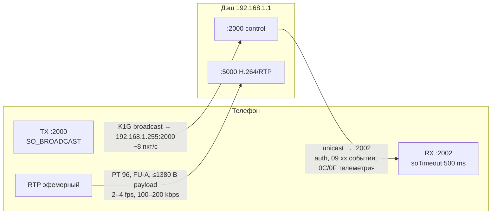
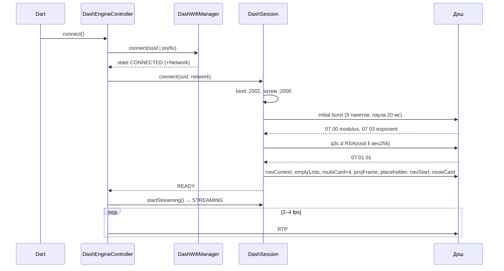
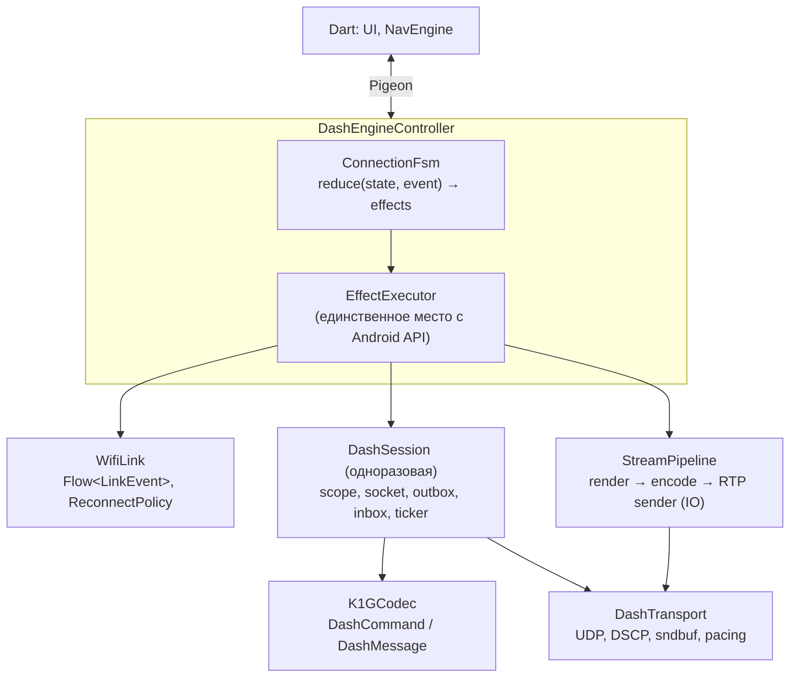

# Сетевой слой взаимодействия с дэшем: аудит и предложения по переработке

Дата: 2026-09-09. Ветка `fix/need-to-fix-native-engine`, HEAD `d8068db`.

Объект аудита — всё, что лежит между экраном телефона и приборкой мотоцикла:
Wi-Fi-линк, UDP-сокеты, протокол K1G (хендшейк, карточки, keep-alive, события
дэша), RTP-поток H.264 и координатор, который всё это сводит. Код в
`packages/opendash_dash_engine/android/.../dash/` и
`DashEngineController.kt`, спецификации в `spec/wifi_retry_policy.md`,
`spec/video.md`, `spec/fsm.md`.

## 1. Резюме

Слой **работает и хорошо задокументирован**, но архитектурно он — ручной
актор на разделяемом изменяемом состоянии: 8 полей `Job`, 26 `@Volatile`,
14 ручных `cancel()` в трёх разных путях teardown'а, токен `sessionSeq`,
«клейм» `farewellSocket`, проверка идентичности сокета в каждом периодическом
отправителе и два счётчика, которые считают, как часто гонки, против которых
всё это построено, реально срабатывают. Каждый из этих механизмов закрывает
реальную полевую находку (в комментариях — даты и логи), но вместе они
описывают систему, где корректность держится на дисциплине, а не на
структуре. Последние пять коммитов в этой ветке — про гонки; следующая гонка
будет найдена так же, в поле.

Главные выводы:

1. **Конкурентность.** Сессия должна стать одноразовым объектом со
   структурированной областью корутин: `connect()` создаёт новый
   `DashSession`, все его корутины — дети одного `Job`, отмена родителя
   гасит всё. Это одним движением убирает `sessionSeq`, `farewellSocket`,
   `sendIfCurrent`, `staleSends`, `supersededTeardowns` и три дублирующих
   списка `cancel()`. Исходящие пакеты идут через один `Channel` и одну
   корутину-отправитель — порядок seq-байта получается бесплатно, без
   `synchronized` вокруг syscall'а.
2. **Протокол.** K1G закодирован как hex-строки с «патчем по поиску
   маркера» (`indexOf(06 10 00 01)`, поиск с конца в route card). Это
   работает, пока ни одно значение не совпадает с маркером, и никем не
   проверяется: на весь сетевой слой один JVM-тест (`TxSequencer`).
   Нужна типизированная модель сообщений (`sealed interface`), кодек TLV с
   round-trip-тестами и **golden-тесты на байтовое равенство с захватами**
   — они же становятся страховкой для всего остального рефакторинга.
3. **Координация трёх уровней** (Wi-Fi / сессия / стрим) размазана по двум
   коллекторам `StateFlow`, флагу `sessionStarted`, счётчику `authRetries`
   и таймеру `giveupJob`. Спека `wifi_retry_policy.md` прямо перечисляет
   сценарии, где уровни друг о друге не знают. Целевая форма — один
   конечный автомат соединения с чистым редьюсером
   `(state, event) → (state, effects)`, тестируемым на JVM с виртуальным
   временем, и политикой реконнекта с экспоненциальным backoff'ом и
   джиттером вместо фиксированных 8 с.
4. **Транспорт.** Отсутствуют базовые для realtime-UDP-по-Wi-Fi вещи: DSCP
   (`setTrafficClass`) для RTP и control-plane — на Wi-Fi это очередь WMM,
   единственный рычаг приоритета; `SO_SNDBUF`; пейсинг всплеска из ~30
   датаграмм на каждом IDR; отправка RTP идёт с CPU-пула
   `Dispatchers.Default`; приём выделяет 64 КБ на каждый вызов и
   просыпается дважды в секунду по таймауту вместо блокирующего чтения.
5. **Безопасность.** `androidx.security:security-crypto` (1.1.0-alpha06)
   объявлена deprecated; RSA-1024 PKCS#1 v1.5 — диктуется дэшем, менять
   нельзя, но AES-ключ сессии используется только для расшифровки 0F в лог.

Переписывать «с нуля» не нужно и опасно: протокол реверс-инженерный, и
единственная спецификация — pcap и поведение живой приборки. Правильный
путь — **сначала characterization-тесты на байты, потом рефакторинг под их
защитой**, слой за слоем (раздел 6).

## 2. Как устроено сейчас

### 2.1 Файлы

| Файл | Строк | Роль |
|---|---:|---|
| [DashSocket.kt](packages/opendash_dash_engine/android/src/main/kotlin/com/opendash/opendash_dash_engine/dash/DashSocket.kt) | 165 | Три `DatagramSocket` + `TxSequencer` (seq-байт под локом) |
| [K1GPacket.kt](packages/opendash_dash_engine/android/src/main/kotlin/com/opendash/opendash_dash_engine/dash/protocol/K1GPacket.kt) | 107 | Сборка/разбор TLV-пакета, `patchSeq` |
| [DashCommands.kt](packages/opendash_dash_engine/android/src/main/kotlin/com/opendash/opendash_dash_engine/dash/protocol/DashCommands.kt) | 380 | Все исходящие команды: hex-шаблоны + патчи по маркеру |
| [DashAuth.kt](packages/opendash_dash_engine/android/src/main/kotlin/com/opendash/opendash_dash_engine/dash/DashAuth.kt) | 90 | RSA-1024 → AES-256 хендшейк |
| [DashSession.kt](packages/opendash_dash_engine/android/src/main/kotlin/com/opendash/opendash_dash_engine/dash/DashSession.kt) | 913 | Сессия: RX-цикл, auth, вход в nav, 5 периодических отправителей, 3 пути teardown |
| [DashWifiManager.kt](packages/opendash_dash_engine/android/src/main/kotlin/com/opendash/opendash_dash_engine/dash/DashWifiManager.kt) | 620 | `WifiNetworkSpecifier`, реконнект, RSSI, привязка процесса к сотовой сети |
| [DashEngineController.kt](packages/opendash_dash_engine/android/src/main/kotlin/com/opendash/opendash_dash_engine/DashEngineController.kt) | 1513 | Координатор Wi-Fi + сессия + рендер/энкод/RTP цикл + камера |
| [RtpPacketizer.kt](packages/opendash_dash_engine/android/src/main/kotlin/com/opendash/opendash_dash_engine/dash/video/RtpPacketizer.kt) | 103 | RFC 6184, single NAL + FU-A |
| [NalProcessor.kt](packages/opendash_dash_engine/android/src/main/kotlin/com/opendash/opendash_dash_engine/dash/video/NalProcessor.kt) | 137 | Annex-B → NAL, склейка SPS/PPS/IDR, фильтр SEI/AUD |
| [DashEncoder.kt](packages/opendash_dash_engine/android/src/main/kotlin/com/opendash/opendash_dash_engine/dash/video/DashEncoder.kt) | 398 | MediaCodec, CBR 200/100 kbps, IDR каждые 8 кадров |
| [DashKeepAliveService.kt](packages/opendash_dash_engine/android/src/main/kotlin/com/opendash/opendash_dash_engine/dash/DashKeepAliveService.kt) | 161 | Foreground service, wake lock, Wi-Fi lock |

Тестов на сетевой слой: один —
[DashSocketOrderingTest.kt](packages/opendash_dash_engine/android/src/test/kotlin/com/opendash/opendash_dash_engine/dash/DashSocketOrderingTest.kt).

### 2.2 Порты и потоки данных



Исходящий трафик в `STREAMING` — шесть независимых корутин, пишущих в один
сокет: heartbeat 1 Гц + time sync раз в 30 с
([DashSession.kt:740](packages/opendash_dash_engine/android/src/main/kotlin/com/opendash/opendash_dash_engine/dash/DashSession.kt#L740)),
projection frame 4 Гц
([:795](packages/opendash_dash_engine/android/src/main/kotlin/com/opendash/opendash_dash_engine/dash/DashSession.kt#L795)),
route card 1 Гц
([:805](packages/opendash_dash_engine/android/src/main/kotlin/com/opendash/opendash_dash_engine/dash/DashSession.kt#L805)),
nav info 1 Гц
([:815](packages/opendash_dash_engine/android/src/main/kotlin/com/opendash/opendash_dash_engine/dash/DashSession.kt#L815)),
media/call 1 Гц
([:836](packages/opendash_dash_engine/android/src/main/kotlin/com/opendash/opendash_dash_engine/dash/DashSession.kt#L836)),
плюс RX-цикл с ack'ами и эхом кнопок
([:622](packages/opendash_dash_engine/android/src/main/kotlin/com/opendash/opendash_dash_engine/dash/DashSession.kt#L622))
и внеочередной `updateRouteCard`
([:315](packages/opendash_dash_engine/android/src/main/kotlin/com/opendash/opendash_dash_engine/dash/DashSession.kt#L315)),
который идёт мимо `sendIfCurrent`.

### 2.3 Жизненный цикл соединения



## 3. Что сделано хорошо

Об этом стоит сказать явно, потому что предложения ниже — не «всё
переписать», а «перенести уже найденные инварианты в структуру».

- **Порядок открытия сокетов** (RX до первого TX, чтобы не ловить ICMP
  port-unreachable) зафиксирован и объяснён —
  [DashSocket.kt:16](packages/opendash_dash_engine/android/src/main/kotlin/com/opendash/opendash_dash_engine/dash/DashSocket.kt#L16).
- **Seq-байт и отправка под одним локом** — верное решение, с тестом на 10
  потоков.
- **Прощальные пакеты** `projectionStop`/`projectionOff` при разрыве, чтобы
  дэш не висел на последнем кадре.
- **Монотонный PTS для RTP**, marker bit только на последнем пакете AU,
  раздельная отправка SPS/PPS/IDR при превышении MTU, запрет STAP-A — всё по
  RFC 6184 и по поведению дэша.
- **CBR + выбор энкодера по `COLOR_FormatSurface`**, а не по
  `isFormatSupported`, с объяснением, почему.
- **RideDiagnostics**: файл на поездку, переживающий релиз, с одноразовыми
  вехами («first video frame sent» / «dash DECODED first IDR»).
- **Раздельная привязка**: сокеты дэша — к Wi-Fi через `Network.bindSocket`,
  процесс — к сотовой сети ради Yandex MapKit. Это правильный способ жить с
  no-internet-сетью на Android 10+.
- Комментарии с датами и логами. Для реверс-инженерного протокола это и есть
  спецификация.

## 4. Находки по слоям

### 4.1 Сокеты и транспорт

**Приём.** `receive()` выделяет `ByteArray(65535)` на каждый вызов и
блокируется на 500 мс
([DashSocket.kt:57](packages/opendash_dash_engine/android/src/main/kotlin/com/opendash/opendash_dash_engine/dash/DashSocket.kt#L57),
[:103](packages/opendash_dash_engine/android/src/main/kotlin/com/opendash/opendash_dash_engine/dash/DashSocket.kt#L103)).
Таймаут нужен только как «точка опроса отмены», потому что
`DatagramSocket.receive` не прерывается корутинной отменой. Это два
пробуждения CPU в секунду и 128 КБ мусора в секунду в простое — при
удерживаемом wake lock не критично, но и не нужно. Современный приём:
блокирующий `receive` без таймаута на выделенном потоке или на
`Dispatchers.IO`, а отмена — через `socket.close()` из
`invokeOnCancellation`/`finally`; буфер — один переиспользуемый на цикл
(K1G-пакеты — десятки-сотни байт). Датаграмма ≤ 1500 байт на этом линке,
64 КБ — защита от ситуации, которой не бывает.

**Отправка RTP с CPU-пула.** `RtpPacketizer` вызывает `session.sendRtp`
синхронно из кадрового цикла, который запущен на `Dispatchers.Default`
([DashEngineController.kt:867](packages/opendash_dash_engine/android/src/main/kotlin/com/opendash/opendash_dash_engine/DashEngineController.kt#L867),
[:969](packages/opendash_dash_engine/android/src/main/kotlin/com/opendash/opendash_dash_engine/DashEngineController.kt#L969)).
`DatagramSocket.send` — syscall, который может блокироваться, когда
переполнена очередь Wi-Fi-драйвера. Один IDR в 39,7 КБ (число из логов
2026-09-09) — это ~30 датаграмм подряд без пауз. Правильно: отправитель RTP
— отдельная корутина/поток на IO с очередью, кадровый цикл только кладёт в
неё.

**Нет пейсинга IDR-всплеска.** 30 датаграмм за микросекунды на Wi-Fi-линк с
одним embedded-клиентом — классический сценарий потери хвоста всплеска в
буфере AP/STA. При UDP без ретрансмиссии потеря одного фрагмента FU-A
= потеря всего IDR = мусор до следующего ключевого кадра (2–4 с).
Растянуть отправку фрагментов одного AU на ~20–40 мс (при 250 мс на кадр
это бесплатно) — самое дешёвое, что можно сделать для устойчивости картинки.

**Нет DSCP/TOS.** `setTrafficClass` не вызывается нигде. На Wi-Fi DSCP
отображается в очереди WMM (AC_VO/AC_VI/AC_BE/AC_BK), и это единственный
механизм приоритета, который телефон контролирует. RTP → `0xB8` (EF) или
`0x88` (AF41, AC_VI); K1G control → EF. Дэш это не заметит, но
Wi-Fi-стек телефона — да, особенно при одновременной активности других
приложений. Эффект нужно мерить, но стоимость — одна строка.

**Нет `SO_SNDBUF`.** Дефолт Android — 200 КБ+, IDR влезает, но явно задать
и залогировать `sendBufferSize` стоит: это та цифра, которую спросят при
разборе «картинка замерла».

**`SO_REUSEADDR` на :2000 и :2002** прячет утечки: комментарий в
[DashSession.kt:400](packages/opendash_dash_engine/android/src/main/kotlin/com/opendash/opendash_dash_engine/dash/DashSession.kt#L400)
сам описывает, что утёкший сокет продолжает получать часть трафика дэша
(«дэш замолчал» вместо ошибки). При владении сокетом строго одной сессией
(раздел 5) флаг можно снять — тогда утечка станет `BindException`, то есть
громкой.

**Адреса захардкожены**: `192.168.1.1`, `192.168.1.255`. У `Network` есть
`LinkProperties` с адресом интерфейса, префиксом и DHCP-сервером —
широковещательный адрес и адрес дэша выводятся из них. Низкий приоритет,
но защищает от прошивки с другой подсетью и ничего не стоит.

**Catch-all `Exception` в `send`** глушит всё, включая
`NetworkOnMainThreadException` — именно так были потеряны прощальные пакеты
(комментарий в
[DashSession.kt:341](packages/opendash_dash_engine/android/src/main/kotlin/com/opendash/opendash_dash_engine/dash/DashSession.kt#L341)).
Ловить надо `IOException`; остальное — баг, который должен быть виден.

### 4.2 Протокол K1G

**Модель — hex-строки.** Магия `4B 31 47 20` встречается в файле 22 раза,
почти всегда внутри строкового литерала с полным заголовком. Значения
патчатся поиском маркера: `heartbeat` ищет `06 10 00 01` и пишет байт после
него
([DashCommands.kt:118](packages/opendash_dash_engine/android/src/main/kotlin/com/opendash/opendash_dash_engine/dash/protocol/DashCommands.kt#L118)),
`routeCard` ищет `05 09 00 02` и ещё шесть маркеров с конца
([:186](packages/opendash_dash_engine/android/src/main/kotlin/com/opendash/opendash_dash_engine/dash/protocol/DashCommands.kt#L186)),
`patchSeq` ищет магию `K1G ` с начала пакета
([K1GPacket.kt:58](packages/opendash_dash_engine/android/src/main/kotlin/com/opendash/opendash_dash_engine/dash/protocol/K1GPacket.kt#L58)).

Перепроверка показала, что **сегодня всё это корректно**: магия в заголовке
стоит на фиксированном смещении 12 и всегда находится раньше любой
пользовательской строки; суффикс route card после названия — фиксированный
шаблон, и поиск с конца находит настоящие маркеры прежде, чем дойдёт до
названия; патчи применяются в порядке, при котором записанное значение не
образует маркер для следующего поиска (например, `totalDist = 0x0546`
перед настоящим `05 46 00 01` даёт `05 46 05 46 00 01`, а не второй
маркер). Но это корректность **по проверке глазами**, а не по построению:
она не зафиксирована ни одним тестом, и следующий, кто добавит поле или
поменяет порядок патчей, будет проверять её заново тем же способом.

`activeNavPacket` собирает пакет через `StringBuilder` из hex и обратно в
байты
([:324](packages/opendash_dash_engine/android/src/main/kotlin/com/opendash/opendash_dash_engine/dash/protocol/DashCommands.kt#L324))
— раз в секунду, не страшно, но это признак, что типизированного пути
сборки нет и каждая команда изобретает свой.

**Разбор входящих** лоялен к мусору
([K1GPacket.kt:74](packages/opendash_dash_engine/android/src/main/kotlin/com/opendash/opendash_dash_engine/dash/protocol/K1GPacket.kt#L74)):
`outer_len` не сверяется с размером датаграммы, обрезанный TLV принимается
молча. Для RE-протокола лояльность правильна, но отсутствие счётчика
«malformed» лишает сигнала.

**Входящий seq-байт не читается.** Если дэш нумерует свои пакеты так же
(структура заголовка `[4:8] ignored`), по нему можно посчитать потери
dash→phone и дубли — бесплатная метрика качества линка, которой сейчас нет.

**Диспетчеризация** — цепочка `if (tlv.type == 0x09 && tlv.sub == 0x06 &&
value[0] == 0x55)`
([DashSession.kt:633](packages/opendash_dash_engine/android/src/main/kotlin/com/opendash/opendash_dash_engine/dash/DashSession.kt#L633)).
Знания о протоколе (что значит 09 06 55, 0F 05 — BSSID, 0C — телеметрия)
живут в комментариях, а не в типах.

**Что предлагается.** Модель сообщений как `sealed interface` с одним
кодеком:

```kotlin
sealed interface DashMessage {           // dash → phone
    data class AuthModulus(val bytes: ByteArray) : DashMessage
    data class AuthExponent(val bytes: ByteArray) : DashMessage
    data class AuthResult(val accepted: Boolean) : DashMessage
    data object DecoderOpenedIdr : DashMessage
    data object DecoderOpenedP : DashMessage
    data class Button(val code: Int, val raw: ByteArray) : DashMessage
    data class Identity(val field: Int, val cipher: ByteArray) : DashMessage   // 0F
    data class Telemetry(val sub: Int, val value: ByteArray) : DashMessage    // 0C
    data class Unknown(val tlv: Tlv) : DashMessage
}

sealed interface DashCommand {           // phone → dash
    data object AuthRequest : DashCommand
    data class AuthKey(val ciphertext: ByteArray) : DashCommand
    data class RouteCard(val title: String, val projection: Boolean,
                         val maneuver: Int?, val eta: String?, /*…*/) : DashCommand
    data class Heartbeat(val tempC: Int) : DashCommand
    data class TimeSync(val h: Int, val m: Int, val s: Int) : DashCommand
    // …
}

object K1GCodec {
    fun encode(cmd: DashCommand): ByteArray      // всегда через build(tlvs)
    fun decode(datagram: ByteArray): List<DashMessage>
}
```

Route card перестаёт быть «шаблоном с патчами» и становится списком
типизированных полей, из которых собирается TLV. Чтобы это было безопасно,
**сначала** пишутся golden-тесты: для каждого шаблона из `DashCommands`
фиксируется байтовый вывод при заданных аргументах (`heartbeat(25)`,
`routeCard("Tailles de Mas du Gr", …)` должен дать ровно `NAV_TEMPLATE`), и
новая сборка обязана давать те же байты. Это единственная спецификация,
которая есть; её нужно превратить в тесты до любого рефакторинга.

Для sequence-скриптов (initial burst, вход в nav со своими паузами 40/100/
500/60/10 мс) — данные, а не код: `List<Step(command, pauseMs)>`, чтобы
пауза читалась как часть протокола, а не как `delay()` между строками.

### 4.3 Сессия и конкурентность

Это центральная проблема. Один `DashSession` живёт всю жизнь плагина и
переиспользуется между подключениями, поэтому каждое поле — разделяемое
состояние между «старой» и «новой» сессией, и каждая защита в файле
существует именно из-за этого:

| Механизм | Где | Что защищает |
|---|---|---|
| `sessionSeq` токен | [:108](packages/opendash_dash_engine/android/src/main/kotlin/com/opendash/opendash_dash_engine/dash/DashSession.kt#L108) | `fail`/`endLink` устаревшей сессии не трогают живую |
| `farewellSocket` клейм | [:75](packages/opendash_dash_engine/android/src/main/kotlin/com/opendash/opendash_dash_engine/dash/DashSession.kt#L75) | `finally` в `runSession` не закрывает сокет под прощальными пакетами |
| `sendIfCurrent` по идентичности | [:287](packages/opendash_dash_engine/android/src/main/kotlin/com/opendash/opendash_dash_engine/dash/DashSession.kt#L287) | тик старого отправителя не пишет в новый сокет |
| `handedOff` | [:404](packages/opendash_dash_engine/android/src/main/kotlin/com/opendash/opendash_dash_engine/dash/DashSession.kt#L404) | кто закрывает сокет — `runSession` или сессия |
| `staleSends`/`supersededTeardowns` | [:305](packages/opendash_dash_engine/android/src/main/kotlin/com/opendash/opendash_dash_engine/dash/DashSession.kt#L305) | считают, сработало ли всё вышеперечисленное |
| Три списка `cancel()` | `disconnect`, `endLink`, `fail` | ручная отмена семи job'ов |

Дополнительно:

- Ожидание аутентификации — polling `while (!authConfirmed) delay(100)`
  ([:439](packages/opendash_dash_engine/android/src/main/kotlin/com/opendash/opendash_dash_engine/dash/DashSession.kt#L439)).
  Это `CompletableDeferred` + `withTimeout(AUTH_TIMEOUT)`.
- `disconnect()` делает `runBlocking(Dispatchers.IO)` с main-потока
  ([:361](packages/opendash_dash_engine/android/src/main/kotlin/com/opendash/opendash_dash_engine/dash/DashSession.kt#L361)).
  Обоснование в комментарии верное (dispose отменяет scope на следующей
  строке), но это следствие того, что у прощания нет своего владельца.
- Пять периодических отправителей — пять корутин с собственными `delay`.
  Один тикер 250 мс с делителями (route card на каждом 4-м, heartbeat на
  каждом 4-м со сдвигом, time sync на каждом 120-м) даёт один поток,
  детерминированный порядок пакетов и тривиальную проверку с виртуальным
  временем.
- RX watchdog смотрит только `STREAMING`; в `READY` и во время
  `enterNavMode` молчание дэша не замечается. Окно короткое, но правило
  «нет входящих N секунд → линк мёртв» должно быть одно для всех состояний
  после auth.
- `heartbeat(tempC = 25)` — температура захардкожена
  ([DashCommands.kt:118](packages/opendash_dash_engine/android/src/main/kotlin/com/opendash/opendash_dash_engine/dash/protocol/DashCommands.kt#L118)).
  Если дэш её показывает, это ложь на приборе; если нет — лишнее поле.

**Целевая форма** — в разделе 5.1. Ключевая идея: `DashSession` создаётся на
одно подключение, владеет сокетом и `CoroutineScope(SupervisorJob(parent))`,
и умирает вместе с ним. «Старой сессии» не существует как объекта, которому
можно навредить: её scope отменён, её сокет закрыт в её же `finally`, её
поля никто не читает. Все проверки из таблицы становятся невозможными по
построению.

### 4.4 Wi-Fi-слой и реконнект

`DashWifiManager` — 10 изменяемых полей и state machine, размазанная по
четырём коллбэкам `NetworkCallback` и трём корутинам-поллерам. Все
сценарии из `spec/wifi_retry_policy.md` подтверждаются кодом:

- Фиксированная пауза `RECONNECT_DELAY = 8 с`
  ([DashWifiManager.kt:59](packages/opendash_dash_engine/android/src/main/kotlin/com/opendash/opendash_dash_engine/dash/DashWifiManager.kt#L59))
  без эскалации и без джиттера. Стандарт — экспоненциальный backoff с
  полным джиттером и потолком (например 2 → 4 → 8 → 16 → 30 с), сброс при
  успешном линке.
- `CONNECT_TIMEOUT = 30 с` + первая попытка без `hasConnectedOnce` →
  `ERROR` и `wantConnected = false`
  ([:396](packages/opendash_dash_engine/android/src/main/kotlin/com/opendash/opendash_dash_engine/dash/DashWifiManager.kt#L396)).
  Спека уже предлагает вариант оригинального приложения — `requestNetwork`
  без таймаута; поддерживаю: ОС сама ждёт появления сети, и «дэшу нужно
  больше 30 с, чтобы подняться» перестаёт быть ошибкой.
- Политика реконнекта неотделима от Android API и потому не тестируется.
  Её нужно вынести в чистый класс `ReconnectPolicy(attempt, everConnected,
  elapsed) → Delay | GiveUp`, а `NetworkCallback` обернуть в `callbackFlow`
  и отдавать наверх как `Flow<LinkEvent>` (`Available(network, ssid?)`,
  `Lost`, `Unavailable`, `SsidResolved`).
- Привязка процесса к сотовой сети
  ([:257](packages/opendash_dash_engine/android/src/main/kotlin/com/opendash/opendash_dash_engine/dash/DashWifiManager.kt#L257))
  — верное решение для MapKit, но это глобальный побочный эффект на весь
  процесс (включая Flutter HTTP и загрузку паков). Он должен быть явно
  описан в спеке настроек/офлайн-карт, чтобы «скачивание идёт по мобильной
  сети, пока подключён дэш» не стало сюрпризом.
- **Wi-Fi-лок на Android 14+ не работает с выключенным экраном.**
  `WIFI_MODE_FULL_HIGH_PERF` в keep-alive-сервисе
  ([DashKeepAliveService.kt:112](packages/opendash_dash_engine/android/src/main/kotlin/com/opendash/opendash_dash_engine/dash/DashKeepAliveService.kt#L112))
  выбран потому, что «активен даже при выключенном экране и в фоне». Так и
  есть до Android 13. Начиная с 14 (`SdkLevel.isAtLeastU()` и флаг
  `high_perf_lock_deprecated`, по умолчанию `true`) `WifiLockManager.
  acquireWifiLock` подменяет его на `WIFI_MODE_FULL_LOW_LATENCY`, а тот
  активен только при включённом экране **и** UID с importance ровно
  `IMPORTANCE_FOREGROUND` (100). Процесс с одним foreground-сервисом имеет
  125 и не проходит `isAppForeground`. Единственное исключение — держатели
  `REQUEST_COMPANION_PROFILE_AUTOMOTIVE_PROJECTION`, а это
  `protectionLevel="internal|role"`. Итог: на Android 14+ с выключенным
  экраном наш лок ничего не делает, и чип сидит в 802.11 power save;
  тестовый телефон на Android 12 этого не показывает. Зарядка на это не
  влияет: в `WifiLockManager` нет ни одного обращения к состоянию батареи
  (она снимает только Doze, Battery Saver и App Standby). Что делать —
  в разделе 8 и в плане: держать оба лока (javadoc прямо описывает эту
  схему), измерить межпакетный интервал входящих на устройстве с 14+, и
  как опцию «на кронштейне, на зарядке» — активность на переднем плане с
  чёрным экраном на минимальной яркости, что и включает LOW_LATENCY.
  Источники: javadoc `WifiManager`, `WifiLockManager.java`,
  `DeviceConfigFacade.java` в `packages/modules/Wifi`, `AndroidManifest.xml`
  фреймворка.
- `WifiNetworkSuggestion` как альтернатива специфайеру рассматривать не
  стоит: suggestion-сети — «интернет-сети» с точки зрения ОС, для
  no-internet-точки поведение непредсказуемо. Специфайер — правильный
  инструмент, и вопрос диалога согласия решается пиннингом BSSID, если логи
  покажут, что он стабилен (инструментация уже есть).

### 4.5 Координатор

`DashEngineController.connect()`
([:340](packages/opendash_dash_engine/android/src/main/kotlin/com/opendash/opendash_dash_engine/DashEngineController.kt#L340))
— два коллектора `StateFlow`, флаг `sessionStarted`, счётчик `authRetries`,
`giveupJob`, и ветка «сессия жива, а линк нет — снести сначала». Каждая
ветка объяснена полевой находкой, и вместе они — тот самый FSM, которого
нет как объекта. Комментарий в
[:484](packages/opendash_dash_engine/android/src/main/kotlin/com/opendash/opendash_dash_engine/DashEngineController.kt#L484)
про «StateFlow replays its current value to a brand-new collector» —
характерный симптом: события выводятся из состояний, а не наоборот.

Предложение — один `ConnectionFsm` с чистым редьюсером:

```kotlin
sealed interface ConnState {
    data object Off : ConnState
    data class WifiRequesting(val attempt: Int, val everUp: Boolean) : ConnState
    data class WifiUp(val network: Network, val ssid: String) : ConnState
    data class Handshaking(val link: WifiUp, val authAttempt: Int) : ConnState
    data class Ready(val link: WifiUp) : ConnState
    data class Streaming(val link: WifiUp) : ConnState
    data class Backoff(val until: Long, val reason: String) : ConnState
}
sealed interface ConnEvent { /* UserConnect, UserDisconnect, LinkUp, LinkLost,
                                AuthOk, AuthFailed, DashSilent, Tick, GiveUpTimer … */ }
sealed interface Effect { /* RequestWifi, ReleaseWifi, StartSession(net, ssid),
                             StopSession(farewell = true), StartStream, StopStream,
                             ScheduleTick(ms), Publish(state) … */ }

fun reduce(s: ConnState, e: ConnEvent): Pair<ConnState, List<Effect>>
```

Редьюсер тестируется на JVM за миллисекунды: сценарии A–D из спеки
становятся тестами, а не абзацами. Исполнитель эффектов — единственное
место, где живут Android API. Сейчас ни одна из веток `connect()` не
покрыта тестом и не может быть покрыта.

### 4.6 Видео и RTP

Слой в хорошем состоянии; замечания небольшие:

- Пейсинг и очередь отправки — см. 4.1. Это главное.
- `MAX_PAYLOAD = 1380`: 1380 + 12 (RTP) + 8 (UDP) + 20 (IP) = 1420 при MTU
  1500. Запас 80 байт ничем не объяснён; можно 1400–1440, но выигрыш ~3 %
  — не трогать без замера.
- Нет RTCP и нет обратной связи от дэша о потерях; `09 06/04 55` — не
  per-frame ack (спека это установила). Значит, адаптивный битрейт по
  потерям невозможен, и единственная защита — пейсинг и IDR-интервал.
  Логировать «интервал между IDR» и «размер IDR в датаграммах» в `[stream]`
  — эти две цифры определяют, что видит райдер после одной потерянной
  датаграммы.
- `Random` из `java.util` для seq/SSRC — допустимо, RFC 3550 требует лишь
  непредсказуемости от старта к старту.
- Спека `video.md` описывает переключение профилей оригинала по дистанции до
  манёвра (< 1000 м с гистерезисом); у нас — по `camMoving`. Оба сигнала
  доступны; стоит свести в одну функцию выбора профиля, чтобы правило было
  в одном месте.

### 4.7 Безопасность

- `androidx.security:security-crypto` deprecated (Jetpack Security
  прекращён, alpha06 — последняя рабочая). Хранится SSID и пароль
  `12345678` (заводской). Практический риск нулевой, но библиотека мертва:
  либо обычные `SharedPreferences` с честным комментарием, либо
  `KeyStore`-обёртка в 40 строк. Toast «using fallback storage» из
  конструктора конфига
  ([DashConfig.kt:81](packages/opendash_dash_engine/android/src/main/kotlin/com/opendash/opendash_dash_engine/dash/DashConfig.kt#L81))
  — UI из слоя данных, убрать.
- RSA-1024 PKCS#1 v1.5 без OAEP и AES-ключ в открытом виде после расшифровки —
  диктует дэш, менять нельзя. Но AES-ключ сейчас используется только чтобы
  расшифровать 0F в лог. Если дэш шифрует ещё что-то (или ожидает
  шифрования от нас для 0x03 «settings sync»), это неизвестно —
  зафиксировать как открытый вопрос протокола.
- Hex-дампы всех пакетов в debug-логе содержат SSID (внутри RSA — нет, но
  `hostnameAnnounce`, route card с адресом, треки, звонящие — да).
  `maskSsid` в Wi-Fi-слое есть, в дампах — нет. Для debug-сборки приемлемо;
  для файла поездки (`RideDiagnostics`) проверить, что туда payload не
  попадает — сейчас `joystick`-строка пишет `full=…` value кнопки, это ок.

### 4.8 Тесты и наблюдаемость

Наблюдаемость сильная (ride-файл, счётчики, вехи). Тесты — нет: чистый
JVM-код `K1GPacket`, `DashCommands`, `DashAuth`, `RtpPacketizer`,
`NalProcessor` не имеет ни одного теста, хотя не зависит от Android.

Что нужно, в порядке ценности:

1. **Golden-тесты на байты** для каждой команды (hex из `DashCommands`
   как ожидаемый вывод). Это страховка для всего.
2. **Round-trip TLV**: `decode(encode(x)) == x`, плюс property-тест на
   произвольные TLV (kotest/`kotlin.random`).
3. **DashAuth** с фиксированным RSA-ключом и инжектируемым `SecureRandom`:
   modulus и exponent в разных пакетах, rejection → reset → повтор,
   усечение SSID.
4. **RtpPacketizer**: FU-A реассемблируется в исходный NAL, marker только
   на последнем, seq монотонный, timestamp = base + pts×90.
5. **NalProcessor**: 3- и 4-байтные стартовые коды, IDR без SPS/PPS,
   склейка при ≤ MTU и разделение при >.
6. **Сессия и FSM** с фейковым транспортом (`Channel<ByteArray>` вместо
   сокета) и `runTest`: auth timeout за 15 с виртуального времени, RX
   watchdog, backoff, `disconnect` посреди хендшейка отправляет прощальные
   пакеты ровно один раз.

Инструменты для RE, которых не хватает:

- **Wireshark-диссектор K1G на Lua** в `tools/` — 100 строк, и pcap с дэша
  читается как протокол, а не как hex. Знания из комментариев
  `DashCommands` переезжают в диссектор.
- **pcapng-writer в debug-сборке**: вместо hex-строк в `app_log.txt`
  писать TX/RX в `diag/*.pcapng`; его открывает Wireshark с диссектором
  выше. Формат тривиален.

### 4.9 Граница Dart ↔ native

Состояние уходит в Dart как `Map<String, Any?>` с ~20 ключами
([DashEngineController.kt:394](packages/opendash_dash_engine/android/src/main/kotlin/com/opendash/opendash_dash_engine/DashEngineController.kt#L394)),
парсится вручную в `DashEngineState.fromMap`. Pigeon (кодогенерация
типизированных каналов) — стандарт для плагинов; ошибка в имени ключа
перестаёт быть runtime-null. Не сетевой вопрос в узком смысле, но это
контракт того же слоя.

## 5. Целевая архитектура

### 5.1 Слои



### 5.2 Сессия как структурированный процесс

```kotlin
class DashSession private constructor(
    private val transport: DashTransport,
    private val ssid: String,
    parent: Job,
) {
    private val scope = CoroutineScope(SupervisorJob(parent) + Dispatchers.IO)
    private val outbox = Channel<DashCommand>(Channel.UNLIMITED)
    private val inbox = MutableSharedFlow<DashMessage>(extraBufferCapacity = 64)
    private val authDone = CompletableDeferred<Unit>()

    suspend fun run(onEvent: (SessionEvent) -> Unit) = coroutineScope {
        launch { receiveLoop() }          // блокирующий receive, отмена = close()
        launch { sendLoop() }             // ЕДИНСТВЕННЫЙ писатель: seq + send
        script(InitialBurst)
        withTimeout(AUTH_TIMEOUT) { authDone.await() }
        script(EnterNavMode)
        onEvent(SessionEvent.Ready)
        launch { ticker() }               // один тикер 250 мс: projFrame, card, nav, media, hb
        launch { watchdog() }             // тишина > 10 с в любом состоянии после auth
    }

    fun send(cmd: DashCommand) { outbox.trySend(cmd) }

    suspend fun close(farewell: Boolean) {
        if (farewell) { outbox.send(ProjectionStop); outbox.send(ProjectionOff); outbox.close() }
        sendJob.join()                     // прощание ушло — теперь можно
        scope.cancel(); transport.close()
    }
}
```

Что исчезает: `sessionSeq`, `farewellSocket`, `handedOff`, `sendIfCurrent`,
`staleSends`, `supersededTeardowns`, восемь полей `Job`, три списка
`cancel()`, `runBlocking` в `disconnect`, `@Volatile` на состоянии сессии,
polling auth. Что остаётся: те же байты на проводе, тот же порядок, тот же
seq — и golden-тесты это докажут.

### 5.3 Транспорт

```kotlin
class DashTransport(network: Network, link: LinkProperties) : AutoCloseable {
    // ctrl :2000 (broadcast из link.prefix), rx :2002, rtp — как сейчас
    init {
        ctrl.trafficClass = 0xB8            // EF → WMM AC_VO
        rtp.trafficClass  = 0x88            // AF41 → AC_VI
        rtp.sendBufferSize = 256 * 1024
        // без SO_REUSEADDR: утечка сокета = BindException, а не тихая потеря пакетов
    }
    suspend fun sendRtpBurst(packets: List<ByteArray>, spreadMs: Long) // пейсинг IDR
    fun receiveBlocking(into: ByteArray): Int                           // без таймаута
}
```

### 5.4 Реконнект

```kotlin
class ReconnectPolicy(private val base: Long = 2_000, private val cap: Long = 30_000,
                      private val giveUpAfter: Long = 120_000) {
    fun next(attempt: Int, everConnected: Boolean, elapsed: Long, rnd: Random): Decision =
        when {
            elapsed >= giveUpAfter -> Decision.GiveUp
            !everConnected && attempt >= 2 -> Decision.GiveUp   // или без лимита, если requestNetwork без таймаута
            else -> Decision.RetryIn(rnd.nextLong(0, min(cap, base shl attempt)))
        }
}
```

## 6. План миграции

Порядок — от нулевого риска для протокола к большему; каждый этап
самостоятелен и оставляет код рабочим.

| Этап | Что | Риск для протокола | Проверка |
|---|---|---|---|
| 0 | Golden-тесты на все команды `DashCommands` + round-trip `K1GPacket` + тесты `RtpPacketizer`/`NalProcessor`/`DashAuth` | нет | `./gradlew :opendash_dash_engine:testDebugUnitTest` |
| 1 | Транспорт: DSCP, `SO_SNDBUF`, RTP-отправка с IO-очередью, пейсинг IDR, переиспользуемый RX-буфер | нет (байты те же) | ride-лог `[stream]`: доля IDR, замер потерь по картинке |
| 2 | `K1GCodec` + `DashCommand`/`DashMessage`; `DashCommands` становится тонкой обёрткой, потом удаляется | низкий — под golden-тестами | те же тесты, один заезд |
| 3 | Одноразовая `DashSession` со structured concurrency, единый outbox, тикер, `CompletableDeferred` auth | средний — тайминги `enterNavMode` и порядок пакетов | тест с фейковым транспортом на порядок и тайминги + заезд |
| 4 | `WifiLink` как `Flow<LinkEvent>` + `ReconnectPolicy` с backoff; эксперимент с `requestNetwork` без таймаута | средний — поведение ОС | сценарии A–D как тесты; полевые логи `link up/lost` |
| 5 | `ConnectionFsm` с редьюсером, контроллер = исполнитель эффектов | средний | тесты редьюсера; ride-лог `[session]`/`[wifi]` без изменений формата |
| 6 | Pigeon, Lua-диссектор, pcapng-writer, замена security-crypto | нет | — |

Этапы 0–2 можно сделать без мотоцикла. Этапы 3–5 требуют по одному заезду
каждый, и golden-тесты + pcapng-запись с дэша — способ сравнить «до» и
«после» побайтно, а не «вроде работает».

## 7. Что не трогать и что нельзя проверить без дэша

- Байты всех команд, порядок initial burst и `enterNavMode`, паузы между
  пакетами — это протокол, а не стиль. Менять только с захватом.
- Broadcast для control-plane вместо unicast на 192.168.1.1: reference так
  делает, и почему — неизвестно. Не менять.
- Смысл `09 06/04 55`, поля 0C/0F, 0x03 settings sync — открытые вопросы;
  диссектор и pcapng-запись — способ закрыть их быстрее, чем комментарии.
- `WIFI_MODE_FULL_HIGH_PERF` — оставить как запасной для Android 10–13, но
  добавить `LOW_LATENCY` рядом и переписать комментарий: на 14+ выбор уже
  сделан за нас, см. 4.4.
- CBR ниже declared floor энкодера — открытый эксперимент, у него уже есть
  критерий завершения в комментарии.

## 8. Быстрые победы (до недели, без смены архитектуры)

1. `setTrafficClass` на всех трёх сокетах, `sendBufferSize` на RTP + строка
   в ride-лог с фактическими значениями.
2. RTP-отправка через `Channel` на `Dispatchers.IO`, пейсинг фрагментов
   одного AU на 20–40 мс.
3. Один переиспользуемый RX-буфер; catch `IOException` вместо `Exception` в
   `send`.
4. Golden-тесты для `DashCommands` (уже есть hex — это готовые ожидания).
5. `CompletableDeferred` вместо polling auth.
6. Backoff с джиттером в `scheduleReconnect` — 15 строк.
7. Убрать Toast из `DashConfig`, пометить security-crypto к замене.
8. Счётчик malformed-пакетов и входящий seq-байт в лог раз в минуту рядом
   с `Frame decode acks`.
9. Второй Wi-Fi-лок `WIFI_MODE_FULL_LOW_LATENCY` рядом с `HIGH_PERF` и
   строка в ride-лог с `SDK_INT` и режимом, который реально мог сработать;
   межпакетный интервал входящих от дэша (медиана/p95 за минуту) — чтобы
   на Android 14+ измерить, а не гадать, что делает power save с линком.
