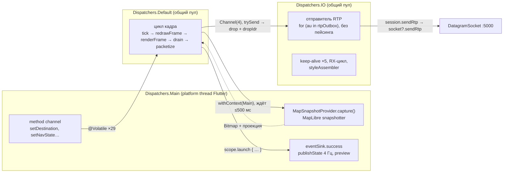
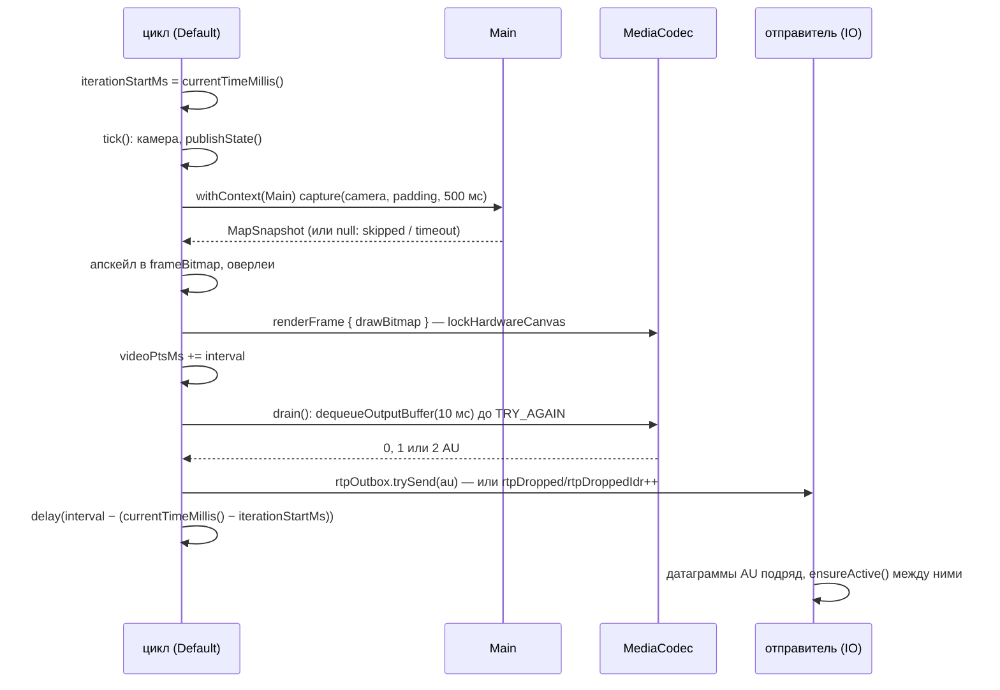
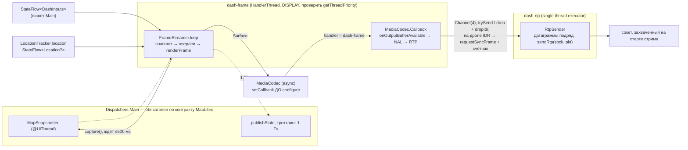

# Конвейер кадра дэша: аудит потоков и план переработки

Дата: 2026-09-14. Ветка `main`, HEAD `7687d89` (влит `network-refactoring`).
Первая редакция — 11.09.2026 по `2688386`; все ссылки и находки ниже
перепроверены по текущему коду, изменения с прошлой редакции сведены в §0.

Объект аудита — путь одного кадра от камеры до сокета: снапшот MapLibre,
оверлеи, `MediaCodec`, пакетизация RTP, отправка, и потоки/диспетчеры, на
которых всё это исполняется. Код в `DashEngineController.kt`,
`dash/map/`, `dash/video/`, спецификации в `spec/drawing_from_local_tiles.md`
и `spec/video.md`. Сетевой слой (сокеты, K1G, Wi-Fi) разобран отдельно в
`improvemen-dash-protocol.md` — здесь он затрагивается только там, где
конвейер кадра в него упирается.

Документ самодостаточен: в него сведены три прохода. Чтение кода «кто на
каком диспетчере» (находки 4.4, 4.7, 4.8), чтение стыков между потоками
(4.1, 4.2, 4.3, 4.5), и независимая рецензия, которая эти находки
перепроверила по коду и уточнила три формулировки. Поверх — сверка всех
утверждений о внешних API (Android SDK, kotlinx.coroutines, MapLibre,
RFC 6184) с документацией; её результат вшит в соответствующие пункты, а
цитаты и ссылки собраны в §10. Сверка закрыла один из открытых вопросов
отчёта, отменила один довод и переписала три рецепта, которые в исходном
виде не компилировались.

Читать с §1; чинить — по таблице §6; всё, что осталось непроверенным, —
в §9, и оттуда же видно, какие шаги требуют мотоцикла.

## 0. Что изменилось с 11.09.2026

Ветка `network-refactoring` и коммиты вокруг неё задели три находки из
семи. Ни одна не была сделана «по этому отчёту» — совпадение по предмету,
но выводы обновить надо.

**Закрыто полностью.**

- **RX-вотчдог переехал на монотонные часы**
  ([DashSession.kt:539](packages/opendash_dash_engine/android/src/main/kotlin/com/opendash/opendash_dash_engine/dash/DashSession.kt#L539),
  [:628](packages/opendash_dash_engine/android/src/main/kotlin/com/opendash/opendash_dash_engine/dash/DashSession.kt#L628)),
  причём с комментарием, формулирующим правило: «elapsedRealtime, not
  currentTimeMillis, for every duration below». Это была худшая строка
  таблицы 4.1 — ложный «dash silent → link lost» с полным реконнектом. Там
  же появилась метрика `rxGaps`, которой раньше не было.

**Изменилось по существу.**

- **Пейсинг RTP убран** (`e432903`, revert): заезд 10.09 показал, что
  растягивание 18 датаграмм ключевого кадра на 30 мс делает картинку хуже,
  а замеры (`sndbuf=4096KiB`, `drop=0 dropIdr=0` во всех двадцати окнах)
  говорят, что затора, ради которого пейсинг вводился, не существует. Для
  4.5 это значит, что окно «≤30 мс пакетов мёртвого стрима» схлопнулось, а
  вместо `delay()` внутрь цикла пакетов поставлен `ensureActive()`
  ([:1139](packages/opendash_dash_engine/android/src/main/kotlin/com/opendash/opendash_dash_engine/DashEngineController.kt#L1139))
  — ровно с той мотивировкой, которую описывала находка.
- **Дропы ключевых кадров считаются отдельно** — `rtpDroppedIdr`
  ([:946](packages/opendash_dash_engine/android/src/main/kotlin/com/opendash/opendash_dash_engine/DashEngineController.kt#L946)),
  и колбэк энкодера теперь отдаёт `isKey`/`isConfig`. Половина 4.7
  («различать типы AU») сделана; `requestSyncFrame` по-прежнему нет.

**Стало хуже.**

- **Новый слой позиции принёс шесть новых стенных длительностей.**
  `LocationTracker` меряет возраст фикса, паузы между фиксами и окно
  отбраковки через `System.currentTimeMillis()`
  ([:107](packages/opendash_dash_engine/android/src/main/kotlin/com/opendash/opendash_dash_engine/dash/map/LocationTracker.kt#L107),
  [:129](packages/opendash_dash_engine/android/src/main/kotlin/com/opendash/opendash_dash_engine/dash/map/LocationTracker.kt#L129),
  [:201](packages/opendash_dash_engine/android/src/main/kotlin/com/opendash/opendash_dash_engine/dash/map/LocationTracker.kt#L201),
  [:237](packages/opendash_dash_engine/android/src/main/kotlin/com/opendash/opendash_dash_engine/dash/map/LocationTracker.kt#L237)),
  а `PositionTrust` берёт стенные часы значением по умолчанию
  ([PositionQuality.kt:192](packages/opendash_dash_engine/android/src/main/kotlin/com/opendash/opendash_dash_engine/dash/map/PositionQuality.kt#L192)).
  То есть правило записано в `DashSession`, а свежий код уехал мимо него в
  тот же день. Это аргумент за то, чтобы этап 1 был не разовой правкой, а
  завершался общим `monotonicMs()`, мимо которого труднее пройти.

**Полезное для целевой архитектуры.** `LocationTracker.location` — уже
`StateFlow<Location?>`
([:54](packages/opendash_dash_engine/android/src/main/kotlin/com/opendash/opendash_dash_engine/dash/map/LocationTracker.kt#L54)),
то есть половина сигнатуры `FrameStreamer` из §5.2 существует. А
`PositionTrust` с инжектируемыми часами показывает, что в проекте уже
принят стиль «часы — параметр», на который опирается §5.2.

**Не изменилось ничего** в 4.2 (синхронный `drain()` на месте), 4.3
(`Default` + `IO`), 4.4 (рваные чтения там же), 4.6 (снапшот на Main,
`publishState()` из `tick()`), 4.8 (контроллер вырос с 1707 до 1755 строк,
тестов на цикл по-прежнему нет).

## 0.1 Сделано по этому отчёту

**2026-09-14.** Быстрые победы 1-3 из §8, ветка `pipeline-quick-wins`.

- ✅ **Гейт 0.** `DashEncoder.drain()` возвращает число выданных КАДРОВ
  (config-буферы не в счёт), контроллер раскладывает это на `drainMiss=` и
  `drainDouble=` в `[stream]`-строке. Печатаются в обеих ветках, включая
  «0 кадров»: там `drainMiss > 0` отличает «цикл крутился, энкодер молчал» от
  прочего. Оговорка, которую нашло ревью: обратное **не** верно — `drain()`
  вызывается только при `haveFrame`, так что цикл, крутящийся без снапшота,
  тоже даёт `drainMiss=0`; читать вместе с `blank=`/`timeouts=` из `[map]`.
- ✅ **Часы.** `util/Clock.kt`: `monotonicMs()` и `Location.ageMs()`. Переведены
  все длительности в `DashEngineController` (13 мест), `LocationTracker` (5),
  `MapSnapshotProvider` (2), `DashSession` (2), `PositionQuality`,
  `MapLibreLogBridge` и `RideDiagnostics`. Плюс **шесть мест в
  `DashWifiManager`**, которых в §4.1 нет: `downSinceMs`/`downtimeAccumMs`
  меряют ровно окно «мёртвая зона → реконнект» и кормят `downtime=Xms`.
  Отчёт вынес Wi-Fi-слой за скобки, но класс бага тот же.

  Две правки глубже, чем «заменить вызов»:
  - `Fix.atMs` теперь берётся из `elapsedRealtimeNanos`, а не из
    `Location.time`. Все длительности в `PositionQuality` — разности двух
    таких меток, а `Location.time` документирован как «not monotonic»: скачок
    часов между фиксами выглядел бы как прыжок во времени без прыжка в
    позиции, то есть ровно то, на что делит страж телепортации.
  - у `PositionTrust` часы стали **обязательным** параметром без значения по
    умолчанию. Дефолт `::monotonicMs` втащил бы `SystemClock` в файл, который
    специально свободен от Android, и тесты сказали это немедленно, упав на
    стабе. Дефолт `System::currentTimeMillis` — то, с чем он приехал 13.09, и
    он был неверен. Между дефолтом, который ломает тесты, и дефолтом, который
    ломает заезды, правильный ответ — никакого.
- ✅ **`sendRtp` с проверкой идентичности.** `DashSession.sendRtp` заменён на
  `rtpSender()`: захватывает сокет на старте стрима и отказывает, если он уже
  не текущий. Комментарии в `DashEngineController` и в `CLAUDE.md`, которые
  утверждали, что проверки нет, приведены в соответствие. Отказ пишется в
  ride-файл на месте, один раз за стрим, а не в минутную строку рас —
  та живёт в `launchAckCounterLog`, гейтится на `STREAMING` и отменяется
  `disconnect()`, то есть ровно тем событием, при котором единственно и может
  сработать.

Ещё семь правок по ревью, помимо перечисленного: нулевая инициализация
ограничителей против boot-relative часов (`lastDoubtLogAtMs`,
`lastRebuildAtMs` — на малом аптайме глушила первое сообщение), `dt` в строке
`REJECT` считался по `Location.time`, когда решение принимается по монотонной
метке, и противоречивые комментарии в трёх местах.

**Не сделано из §8:** пункты 4-6 (троттлинг `publishState()`, PNG в
`emitFramePreview`, комментарий у плоских счётчиков).

## 0.2 Память: новая находка, вне области этого отчёта

**2026-09-14.** Заезд на Xiaomi 2606FRN72Y (Android 16, 3.6 ГиБ RAM) дал два
`LOW_MEMORY_KILL` за двадцать минут, оба с `importance=400` (`IMPORTANCE_CACHED`)
— то есть система считала приложение кэшированным, а не foreground-сервисом.
Оба убийства попали в промежутки МЕЖДУ сессиями, и девять коротких сессий по
5-12 с подряд похожи на перезапуски вокруг них.

Ride-файл при этом умел сказать только сам факт: `ExitInfoCollector` писал
`reason`, `importance` и `status`, но не `pss`/`rss`. Починено — с оговоркой,
которую нашло ревью и которую надо держать в голове при чтении: эти поля берутся
из ПОСЛЕДНЕЙ выборки системы, а не из момента смерти, и равны нулю, если процесс
умер до того, как его успели опросить. Сессии по 5-12 с — ровно такой случай, так
что вместо голого нуля пишется «not sampled». Плюс заведён тег
`[mem]` — раз в минуту PSS с разбивкой (java/native/graphics/code) и системные
`avail`/`threshold`/`lowMemory`. Считается на `Dispatchers.IO`, а не в кадровом
цикле: `Debug.getMemoryInfo` ходит в `/proc/self/smaps` и стоит десятки
миллисекунд против бюджета в 250.

Одно число в момент смерти отвечает на вопрос «сколько», но не «с какого
момента», а плоские 400 МиБ и растущие до 400 МиБ требуют разных починок.

**Крупная оговорка: это debug-сборка** (`flags=[ DEBUGGABLE … ]`). Flutter в ней
в JIT, а JIT держит заметно больше памяти, чем AOT в релизе, — на телефоне с
3.6 ГиБ это само по себе может объяснять оба убийства. Утверждать «течёт» или
«нужен largeHeap» по этим данным нельзя; сначала числа, потом повтор на
`--release`.

К конвейеру кадра отношения не имеет, записано здесь потому, что найдено при
проверке гейта 0 и трогает те же файлы.

## 0.3 Этап 4 сделан

**2026-09-14.** `DashInputs` + `MutableStateFlow`, ветка `pipeline-quick-wins`.

Одиннадцать `@Volatile` полей навигации, назначения и медиа заменены одним
immutable снимком; `tick()` читает `inputs.value` РОВНО ОДИН РАЗ и передаёт его
в `routeSignature` и `redrawFrame`. Оба подтверждённых рваных чтения из §4.4
закрыты по построению: широта и долгота живут внутри одного `Destination`,
точки и пробки — внутри одного `RouteGeometry`. `@Volatile` в контроллере: 30 → 21.

Писатели переведены на `MutableStateFlow.update`, а не на присваивание: лямбды
чистые, так что CAS-повтор безопасен, и read-modify-write не может потерять
параллельную запись.

**Камера намеренно оставлена на `@Volatile`, и это отход от плана.** §4.4
перечисляет её в составе `DashInputs`, но поток данных там двусторонний: `tick()`
сам сбрасывает пан и follow по истечении ручной паузы, а `startStream` подрезает
зум под пол пака. Снимок-плюс-запись-обратно — это read-modify-write между
потоками, класс гонки, которого сегодня нет.

Оговорка к этому решению, найденная ревью: **дело не в том, что у камеры нет
проблем.** `redrawFrame` читал `headingUp` заново после подвешивания на снапшоте,
и переключение внутри окна в 500 мс рисовало бы heading-up оверлей поверх
north-up растра; починено переиспользованием единственного чтения. А `panAtBound`
пишется из обоих потоков без `@Volatile` — оставлено, потому что гейтит только
строку лога, но сказано вслух: прежний комментарий утверждал «только
MethodChannel-поток», и это была неправда.

Ещё по ревью: `setDestination(name, null, null)` терял бы имя (старое поле
писалось безусловно) — `destName` вынесен из `Destination` отдельным полем;
мёртвый хелпер `jamMatchesPoints`, возвращавший `false` для пустого маршрута,
удалён; два KDoc-блока подряд на `routeSignature`, из которых связывался только
второй; три ссылки на удалённые символы.

## 1. Резюме

Отрисовка и отправка идут **в разных потоках**: цикл кадра на
`Dispatchers.Default`, снапшот карты на `Dispatchers.Main`, отправитель RTP
на `Dispatchers.IO`, стык между циклом и отправителем — `Channel(4)` с дропом
вместо ожидания. Эта расстановка правильная, и переизобретать её не надо:
она решает ровно ту проблему (блокирующий `send` внутри бюджета кадра),
ради которой заведена, и предыдущая попытка с очередью на 64 AU описана в
`CLAUDE.md` вместе с тем, чем она кончилась.

Слабые места — не в расстановке потоков, а на стыках и во владении:

1. **Часы.** Длительности в цикле кадра, в снапшоттере и в слое позиции
   меряются `System.currentTimeMillis()` — стенным клоком, который ходит от
   NTP/NITZ. Проект это знает: `tick()` берёт `nanoTime`, `FrameRatePolicy`
   получает `elapsedRealtime()` с комментарием ровно об этом, RX-вотчдог
   починен 13.09, а `CLAUDE.md` описывает ревью, поймавшее выдержку
   гистерезиса на том же клоке. Урок применяется точечно, и новый код всё
   равно уезжает мимо него. **Единственный пункт, подтверждённый дословно
   документацией и не требующий замера.**
2. **Синхронный `drain()`.** Энкодер опрашивается с таймаутом 10 мс сразу
   после отрисовки. Кадр, не уложившийся в 10 мс, лежит в кодеке до следующей
   итерации и получает PTS следующей итерации; два кадра, вытащенных вместе,
   уходят с **одинаковым** RTP-timestamp. Важно разделять два следствия:
   стабильное опоздание на интервал — косметика, а вот неравномерность и
   двойной штамп — баг. Именно двойной штамп ищет гейт 0.
3. **Real-time путь на общих пулах.** Цикл кадра — на `Default` (общий,
   nCPU потоков, обычный приоритет, другой поток после каждого suspend),
   отправитель — на `IO` (64 потока, общие с keep-alive, приёмом и чтением
   стиля). Ни приоритета, ни идентичности потока.
4. **Владение состоянием.** 29 полей `@Volatile`, пишутся с Main, читаются
   из цикла на `Default`. Два подтверждённых рваных чтения (`routePoints` /
   `routeJam`, `destLat` / `destLng`). Один immutable `DashInputs` вместо
   всех закрывает класс целиком.
5. **Размер.** `DashEngineController` — 1755 строк: камера, GPS, маршрут,
   энкодер, пакетайзер, статистика, Wi-Fi, сессия, медиа. Конвейер кадра
   в нём не тестируется, потому что до него не добраться иначе как через
   весь контроллер.

Ни один из пунктов не требует переписывать с нуля. Порядок — от нулевого
риска к большему: гейт 0 (счётчик исходов `drain()`, три строки) отвечает на
единственный вопрос, от которого зависит объём работы; дальше часы (1) —
механическая правка на час; мелкие правки 4.5 и 4.7 — дешёвые и делаются
сразу; затем `DashInputs` (4), вынос `FrameStreamer` (5) и только потом
выделенные потоки (3) с асинхронным кодеком (2) — это одна работа, и только
она трогает живой энкодер.

## 2. Как устроено сейчас

### 2.1 Файлы

| Файл | Строк | Роль |
|---|---:|---|
| [DashEngineController.kt](packages/opendash_dash_engine/android/src/main/kotlin/com/opendash/opendash_dash_engine/DashEngineController.kt) | 1755 | Координатор Wi-Fi + сессия + **цикл кадра** + камера + телеметрия |
| [DashSession.kt](packages/opendash_dash_engine/android/src/main/kotlin/com/opendash/opendash_dash_engine/dash/DashSession.kt) | 1010 | Сессия; для конвейера — `sendRtp` и RX-вотчдог с `rxGaps` |
| [DashWifiManager.kt](packages/opendash_dash_engine/android/src/main/kotlin/com/opendash/opendash_dash_engine/dash/DashWifiManager.kt) | 620 | Линк до дэша; вне области, см. `improvemen-dash-protocol.md` |
| [MapSnapshotProvider.kt](packages/opendash_dash_engine/android/src/main/kotlin/com/opendash/opendash_dash_engine/dash/map/MapSnapshotProvider.kt) | 605 | MapLibre offscreen: снапшот с дедлайном, детекция зависания, пересоздание |
| [DashEncoder.kt](packages/opendash_dash_engine/android/src/main/kotlin/com/opendash/opendash_dash_engine/dash/video/DashEncoder.kt) | 398 | `MediaCodec` H.264, Surface-вход, CBR 200/100 kbps, синхронный `drain()` |
| [PositionQuality.kt](packages/opendash_dash_engine/android/src/main/kotlin/com/opendash/opendash_dash_engine/dash/map/PositionQuality.kt) | 344 | Доверие к позиции, кросс-проверка провайдеров (новое, 13.09) |
| [DashSocket.kt](packages/opendash_dash_engine/android/src/main/kotlin/com/opendash/opendash_dash_engine/dash/DashSocket.kt) | 309 | UDP; `sendRtp` без identity-check (4.5) |
| [OverlayRenderer.kt](packages/opendash_dash_engine/android/src/main/kotlin/com/opendash/opendash_dash_engine/dash/map/OverlayRenderer.kt) | 294 | Маршрут с пробками, стрелка, пин, пилюли — `Canvas` поверх снапшота |
| [LocationTracker.kt](packages/opendash_dash_engine/android/src/main/kotlin/com/opendash/opendash_dash_engine/dash/map/LocationTracker.kt) | 277 | `StateFlow<Location?>`, отбраковка фиксов (новое, 13.09) |
| [NalProcessor.kt](packages/opendash_dash_engine/android/src/main/kotlin/com/opendash/opendash_dash_engine/dash/video/NalProcessor.kt) | 221 | Annex-B → NAL, склейка SPS/PPS/IDR, граница AU |
| [RenderStats.kt](packages/opendash_dash_engine/android/src/main/kotlin/com/opendash/opendash_dash_engine/dash/map/RenderStats.kt) | 167 | Телеметрия `[map]`: интервалы, `late=`, `blank=` |
| [RtpPacketizer.kt](packages/opendash_dash_engine/android/src/main/kotlin/com/opendash/opendash_dash_engine/dash/video/RtpPacketizer.kt) | 103 | RFC 6184, `ts = base + pts × 90` |
| [FrameRatePolicy.kt](packages/opendash_dash_engine/android/src/main/kotlin/com/opendash/opendash_dash_engine/dash/map/FrameRatePolicy.kt) | 88 | 2 ↔ 4 fps по скорости, с гистерезисом на `elapsedRealtime` |
| [OpendashDashEnginePlugin.kt](packages/opendash_dash_engine/android/src/main/kotlin/com/opendash/opendash_dash_engine/OpendashDashEnginePlugin.kt) | 256 | Scope плагина (`Dispatchers.Main`), каналы в Dart |

Тесты, которых стало заметно больше после `network-refactoring`:
`FrameRatePolicyTest`, `RenderStatsTest`, `DashCameraTest`, `NalProcessorTest`,
`RtpPacketizerTest`, `MapStyleAssemblerTest`, `PackZoomTest`,
`PositionQualityTest`, `DashSocketOrderingTest`, `DashCommandsGoldenTest`,
`K1GPacketTest`, `DashAuthTest`, `MapLibreLogBridgeTest`, `DebugLogTest`.
Это всё — чистые классы и протокол. **На сам цикл кадра по-прежнему ни
одного теста**, и §4.8 ровно про то, почему.

### 2.2 Потоки и что между ними



### 2.3 Одна итерация цикла



Мотивировка развязки отправителя записана в
[DashEngineController.kt:968](packages/opendash_dash_engine/android/src/main/kotlin/com/opendash/opendash_dash_engine/DashEngineController.kt#L968):
`DatagramSocket.send` — syscall, который блокируется при забитой очереди
Wi-Fi-драйвера, и в старой форме ставил дедлайн цикла в зависимость от радио.

## 3. Что сделано хорошо

Предложения ниже — не «переписать», а «перенести уже найденные инварианты в
структуру», поэтому стоит сказать явно, что переносить.

- **Дроп вместо ожидания, и дроп с разбором.** `trySend` в `Channel(4)`,
  `rtpDropped` и отдельный `rtpDroppedIdr`
  ([:1007](packages/opendash_dash_engine/android/src/main/kotlin/com/opendash/opendash_dash_engine/DashEngineController.kt#L1007))
  — правильная семантика для realtime-потока: забитая очередь стоит кадра,
  а не задержки, а два счётчика отличают «потеряли четверть секунды» от
  «потеряли GOP». AU кладётся целиком, частичный AU невозможен.
- **Пейсинг убран по замеру, а не по вкусу.** Комментарий на
  [:1104](packages/opendash_dash_engine/android/src/main/kotlin/com/opendash/opendash_dash_engine/DashEngineController.kt#L1104)
  — образец того, как здесь принимаются решения: гипотеза о заторе
  проверена `sndbuf=4096KiB` и `drop=0` во всех окнах, издержка (18 отдельных
  контенций вместо одного A-MPDU) названа, revert обоснован заездом.
- **`ensureActive()` вместо исчезнувшего `delay()`**
  ([:1139](packages/opendash_dash_engine/android/src/main/kotlin/com/opendash/opendash_dash_engine/DashEngineController.kt#L1139))
  — точка отмены не пропала вместе с пейсингом, и в комментарии записано,
  зачем она тут.
- **`cancel()`, не `close()`** на выходе
  ([:1341](packages/opendash_dash_engine/android/src/main/kotlin/com/opendash/opendash_dash_engine/DashEngineController.kt#L1341))
  — очередь мёртвого стрима не досылается в сокет следующей сессии.
- **Confinement в `MapSnapshotProvider`.** Всё мутабельное состояние —
  только на Main; `snapshotterIssue` как токен против опоздавших колбэков
  ([:344](packages/opendash_dash_engine/android/src/main/kotlin/com/opendash/opendash_dash_engine/dash/map/MapSnapshotProvider.kt#L344));
  `withTimeoutOrNull` корректно отделён от внешней отмены; поздний битмап
  освобождается, а не течёт. Заодно это единственно возможная форма:
  MapLibre требует главного потока (4.6).
- **Владение энкодером через `finally` цикла** вместо `release()` из
  `disconnect()` — комментарий в
  [:603](packages/opendash_dash_engine/android/src/main/kotlin/com/opendash/opendash_dash_engine/DashEngineController.kt#L603)
  описывает закрытую гонку (IllegalStateException-шторм, пересборка
  энкодера без владельца).
- **`cancelAndJoin()` в `startStream`** — новый энкодер не ставится, пока
  старый цикл не отпустил свой.
- **Дедлайн итерации, а не сон поверх работы** — период `max(interval,
  latency)`, как просит спека.
- **Монотонные часы там, где до них дошли руки**: `FrameRatePolicy`
  ([:1437](packages/opendash_dash_engine/android/src/main/kotlin/com/opendash/opendash_dash_engine/DashEngineController.kt#L1437)),
  `nanoTime` для `dt` камеры
  ([:1387](packages/opendash_dash_engine/android/src/main/kotlin/com/opendash/opendash_dash_engine/DashEngineController.kt#L1387)),
  и весь RX-вотчдог после 13.09.
- **`logNegotiatedFormat`** — не перестраховка, а буквально та процедура,
  которую предписывает документация `KEY_LATENCY`: «use the output format to
  verify that this feature was enabled and the actual value used».
- **Телеметрия**: `frames=X/expected`, `late=`, `skipped`, `timeouts`,
  `drop=`, `dropIdr=`, `idrShape=`, `rxGaps`, тег `[gps]`, эхо принятого
  формата энкодера — почти всё, что нужно для проверки находок ниже, уже
  пишется в файл поездки.

## 4. Находки

### 4.1 Стенной клок там, где меряются длительности

`System.currentTimeMillis()` — 17 раз в `DashEngineController.kt`, 5 в
`LocationTracker.kt`, 2 в `MapSnapshotProvider.kt`, 3 в `DashSession.kt`,
1 в `PositionQuality.kt`. Часть из них — штампы для логов, и это правильно.
Остальные измеряют **длительности**, и для этого стенной клок не годится:
NITZ/NTP-коррекция после туннеля или потери сотовой сети (телефон на Wi-Fi
мотоцикла без интернета, но сотовая сеть остаётся) двигает его на секунды
в любую сторону.

Документация Android говорит это прямым текстом: `currentTimeMillis()` «can
be set by the user or the phone network, so the time may jump backwards or
forwards unpredictably… **Interval or elapsed time measurements should use a
different clock**», а `elapsedRealtime()` «guaranteed to be monotonic… **the
recommended basis for general purpose interval timing**».

Где стреляет:

| Место | Что меряется | Шаг часов вперёд | Шаг назад |
|---|---|---|---|
| [DashEngineController.kt:1324](packages/opendash_dash_engine/android/src/main/kotlin/com/opendash/opendash_dash_engine/DashEngineController.kt#L1324) | пейсинг цикла: `delay(interval − (now − iterationStartMs))` | `delay(0)`, один быстрый кадр | на N с назад → **одна итерация спит `interval + N`**; `coerceAtLeast(0)` защищает только от первого случая |
| [:1364](packages/opendash_dash_engine/android/src/main/kotlin/com/opendash/opendash_dash_engine/DashEngineController.kt#L1364), [:1708](packages/opendash_dash_engine/android/src/main/kotlin/com/opendash/opendash_dash_engine/DashEngineController.kt#L1708) | возраст фикса: `currentTimeMillis() − loc.time`, дважды | ложный `gpsLost`/`gpsWeak` | устаревший фикс считается свежим |
| [:1355](packages/opendash_dash_engine/android/src/main/kotlin/com/opendash/opendash_dash_engine/DashEngineController.kt#L1355) | `MANUAL_IDLE_MS = 8 с` — возврат в follow-режим | преждевременный возврат | ручной пан не истекает |
| [:1198](packages/opendash_dash_engine/android/src/main/kotlin/com/opendash/opendash_dash_engine/DashEngineController.kt#L1198)-[:1215](packages/opendash_dash_engine/android/src/main/kotlin/com/opendash/opendash_dash_engine/DashEngineController.kt#L1215), [:1543](packages/opendash_dash_engine/android/src/main/kotlin/com/opendash/opendash_dash_engine/DashEngineController.kt#L1543)-[:1600](packages/opendash_dash_engine/android/src/main/kotlin/com/opendash/opendash_dash_engine/DashEngineController.kt#L1600) | `intervalMs`, `encodeMs`, `snapshotMs`, `overlayMs` в `RenderStats` | мусор в `[map]`-строке ровно в тот момент, когда её читают | то же |
| [LocationTracker.kt:201](packages/opendash_dash_engine/android/src/main/kotlin/com/opendash/opendash_dash_engine/dash/map/LocationTracker.kt#L201), [:237](packages/opendash_dash_engine/android/src/main/kotlin/com/opendash/opendash_dash_engine/dash/map/LocationTracker.kt#L237) | возраст кандидата и пауза между фиксами | фикс объявлен протухшим, ложная «дыра» в `[gps]` | обратное |
| [PositionQuality.kt:192](packages/opendash_dash_engine/android/src/main/kotlin/com/opendash/opendash_dash_engine/dash/map/PositionQuality.kt#L192) | окно доверия в `PositionTrust` | недоверие к живой позиции | доверие к мёртвой |
| [MapSnapshotProvider.kt:294](packages/opendash_dash_engine/android/src/main/kotlin/com/opendash/opendash_dash_engine/dash/map/MapSnapshotProvider.kt#L294) | `WEDGED_MS = 5 с`, `REBUILD_COOLDOWN_MS = 2 с` | живой снапшоттер объявлен зависшим и пересоздан | зависший не замечается |

Строки про возраст фикса — худшие из списка, и стоит понимать почему.
Сравниваются два **стенных** значения, `currentTimeMillis()` и `loc.time`,
и разъезжаются они не в момент потери GPS, а в момент NTP/NITZ-коррекции —
то есть ровно тогда, когда телефон оживает после мёртвой зоны. Баг стреляет
в том самом сценарии, ради которого заведены `gpsLost` и `gpsWeak`.
Документация `Location` описывает лечение прямо: `getElapsedRealtimeNanos()`
«can be reliably compared to `elapsedRealtimeNanos()`, **to calculate the age
of a fix**», тогда как про `getTime()` там же сказано, что UTC-время «is not
monotonic».

Контраст — в самом проекте: `FrameRatePolicy` получает `elapsedRealtime()`
с комментарием «elapsedRealtime, not currentTimeMillis: this is a duration,
and wall clock…»; RX-вотчдог
([DashSession.kt:532](packages/opendash_dash_engine/android/src/main/kotlin/com/opendash/opendash_dash_engine/dash/DashSession.kt#L532))
формулирует то же как правило «for every duration below»; `CLAUDE.md`
помнит ревью, поймавшее выдержку гистерезиса на стенных часах. Класс бага
известен, назван и трижды исправлен точечно — и всё равно новый слой
позиции 13.09 приехал с пятью новыми стенными длительностями. Точечные
правки эту утечку не держат.

**Что делать.** Один `monotonicMs() = SystemClock.elapsedRealtime()` в
общем месте (`util/`) — и все длительности и дедлайны через него;
`currentTimeMillis` — только для штампов в логах. Возраст GPS-фикса —
`SystemClock.elapsedRealtimeNanos() − loc.elapsedRealtimeNanos`. У
`PositionTrust` часы уже параметр, так что там правка — одна строка
значения по умолчанию. Работа на час, механическая, без единого решения,
требующего железа.

**Оговорка, которую стоит внести комментарием при правке.**
`elapsedRealtime()` тикает в deep sleep, а планировщик `delay()` в
kotlinx.coroutines живёт на `nanoTime`, то есть ближе к `uptimeMillis()`.
Для RX-вотчдога и `WEDGED_MS` учёт сна — именно то, что нужно. Для дедлайна
итерации расхождение теоретическое: под foreground-сервисом со стримом deep
sleep не наступает, а если бы наступил — дедлайн уже просрочен и вышло бы
`delay(0)`. Выбор менять не надо, но следующий читатель придёт с этим
вопросом, если не написать.

### 4.2 Синхронный `drain()` — где «нарисовать» и «отправить» всё ещё склеены

[DashEncoder.drain()](packages/opendash_dash_engine/android/src/main/kotlin/com/opendash/opendash_dash_engine/dash/video/DashEncoder.kt#L347):
`dequeueOutputBuffer(info, DRAIN_TIMEOUT_US = 10_000)` в цикле до
`TRY_AGAIN_LATER`, вызывается сразу после `renderFrame`
([:1199-1204](packages/opendash_dash_engine/android/src/main/kotlin/com/opendash/opendash_dash_engine/DashEngineController.kt#L1199)).
Семантика таймаута документирована и описана здесь верно: при
`timeoutUs > 0` метод ждёт до указанного срока и возвращает
`INFO_TRY_AGAIN_LATER`. Если аппаратный энкодер не отдал кадр за 10 мс,
`drain()` возвращает пусто, цикл уходит в `delay()` до дедлайна — 200+ мс —
и **ничего не делает**, пока готовый кадр лежит в кодеке. Он выйдет на
следующей итерации.

Отсюда два **разных** следствия, и их важно не смешивать.

**(а) Стабильное опоздание — косметика.** Если энкодер систематически не
укладывается в 10 мс, это не «иногда +1 интервал», а постоянный сдвиг на
один интервал: каждый кадр получает PTS следующего тика. На статичной карте
526×300 такой сдвиг невидим, и тратить на него работу не надо.
`KEY_LATENCY = 1`
([DashEncoder.kt:219](packages/opendash_dash_engine/android/src/main/kotlin/com/opendash/opendash_dash_engine/dash/video/DashEncoder.kt#L219))
— подсказка кодеку; документация подтверждает, что ключ применим только к
видеоэнкодерам, задаёт латентность в кадрах и **молча игнорируется**, если
не поддержан. Это уже осознано в коде: комментарий на
[:300](packages/opendash_dash_engine/android/src/main/kotlin/com/opendash/opendash_dash_engine/dash/video/DashEncoder.kt#L300)
прямо говорит, что `KEY_PRIORITY`, `KEY_LATENCY` и `KEY_BITRATE_MODE` —
подсказки, и `logNegotiatedFormat` заведён как единственный документированный
способ узнать, приняты ли они.

**(б) Неравномерность и двойной штамп — это и есть баг.** `videoPtsMs`
двигается **до** `drain()`
([:1203](packages/opendash_dash_engine/android/src/main/kotlin/com/opendash/opendash_dash_engine/DashEngineController.kt#L1203)),
а `packetize(nal, endOfAU, ptsMs = videoPtsMs)`
([:979](packages/opendash_dash_engine/android/src/main/kotlin/com/opendash/opendash_dash_engine/DashEngineController.kt#L979))
читает счётчик в момент колбэка. Последовательность при одном промахе:

```
итерация N:   renderFrame(N); pts = N·I; drain() → пусто (>10 мс); delay
итерация N+1: renderFrame(N+1); pts = (N+1)·I; drain() → кадр N со штампом (N+1)·I,
              и если N+1 быстрый — кадр N+1 с тем же (N+1)·I
```

Два AU с одинаковым RTP-timestamp
([RtpPacketizer.kt:45](packages/opendash_dash_engine/android/src/main/kotlin/com/opendash/opendash_dash_engine/dash/video/RtpPacketizer.kt#L45):
`ts = tsBase + ptsMs × 90`).

Что об этом говорит RFC 6184 §5.1. Частота 90 кГц — «A 90 kHz clock rate
MUST be used», формула в пакетайзере верна. NAL-юниты **одного** access unit
несут общий штамп, а границу AU приёмник читает по **маркерному биту** («Set
for the very last packet of the access unit»), а не по смене штампа. Значит
два AU с одинаковым штампом — не нарушение RFC, и говорить «декодер
отбросит один» некорректно. Вред в другом: декодер, планирующий показ по
штампу, покажет второй кадр немедленно. Свойство «равномерно расставленные
штампы», ради которого счётчик заведён вместо стенного клока, держится
только если каждый кадр дренится в ту же итерацию, что отрисован, — и это
условие нигде не проверяется и не считается. Сам комментарий у `videoPtsMs`
([:967](packages/opendash_dash_engine/android/src/main/kotlin/com/opendash/opendash_dash_engine/DashEngineController.kt#L967))
честно говорит, что счётчик «не доказано, что чинит здесь что-то реальное» —
тем более стоит знать, выполняется ли его предпосылка.

**Что делать.** Асинхронный режим `MediaCodec`: `setCallback(cb, handler)` на
выделенном потоке (тот же, что в 4.3), `onOutputBufferAvailable` →
`NalProcessor` → пакетайзер → `trySend`. Цикл кадра сводится к
«снапшот → оверлеи → `renderFrame`», кодек отдаёт кадр, когда закончил, и
кадр уходит немедленно. Документация называет асинхронный режим
предпочтительным начиная с Lollipop, но он приносит с собой три условия,
которых нет в синхронном:

1. **Колбэк ставится до `configure()`** — «the preferred method is to process
   data asynchronously by setting a callback **before** calling `configure`».
   Энкодер в проекте пересобирается при `failures >= 3`
   ([:1302](packages/opendash_dash_engine/android/src/main/kotlin/com/opendash/opendash_dash_engine/DashEngineController.kt#L1302)),
   значит `setCallback` должен жить внутри той же процедуры сборки, а не
   рядом с ней.
2. **После `flush()` обязателен `start()`** — «you must call `start()` after
   `flush()` to transition the codec to the Running sub-state». Требование
   действует и для входа через Surface, и в синхронном режиме его нет:
   любой существующий путь с `flush()` при переезде на async молча
   перестанет отдавать кадры.
3. **Потоку колбэка нужен Looper.** «Callbacks will happen on the handler's
   thread. If null, callbacks are done on the default thread (the caller's
   thread or the main thread)» — то есть `Handler` поверх `HandlerThread`
   из 4.3, и ни в коем случае не null.

PTS при этом берётся из `info.presentationTimeUs`. **Это место не
подтверждено документацией**: SDK говорит только, что при входе через
Surface «buffers are automatically passed from the input surface to the
codec», а кто и по каким часам штампует сам буфер — не описано. Проверяется
замером (§9); запасной вариант — оставить счётчик, но двигать его в
`renderFrame` и брать штамп из очереди «PTS отрисованных кадров» в колбэке.

**Сначала померить (гейт 0).** Счётчик исходов `drain()` за итерацию —
`0 / 1 / ≥2` — в строку `[stream]` рядом с `drop=`. Нули на реальных
поездках — значит 4.2 это апгрейд латентности и можно отложить. Ненули —
значит двойной штамп уже едет в поле, и это приоритет. Цена счётчика — три
строки, и без него этапы 5-6 переделывают живой энкодер под гипотезу.

### 4.3 Real-time путь живёт на общих пулах

Цикл кадра —
[`scope.launch(Dispatchers.Default)`](packages/opendash_dash_engine/android/src/main/kotlin/com/opendash/opendash_dash_engine/DashEngineController.kt#L1099):
общий пул, nCPU потоков, обычный приоритет. Отправитель —
[`launch(Dispatchers.IO)`](packages/opendash_dash_engine/android/src/main/kotlin/com/opendash/opendash_dash_engine/DashEngineController.kt#L1102).
Документация `Dispatchers.IO`: параллелизм «defaults to the limit of 64
threads or the number of cores», и этот диспетчер «**shares threads with
`Dispatchers.Default`**». То есть отправитель делит потоки с
`styleAssembler.assembleCurrent()`, `receive()`, пятью keep-alive,
ack-логгером — и с самим циклом кадра.

**Приоритет.** Конвейер с дедлайном 250 мс при выключенном экране.
Foreground-сервис с `CONNECTED_DEVICE | LOCATION`
([DashKeepAliveService.kt:91](packages/opendash_dash_engine/android/src/main/kotlin/com/opendash/opendash_dash_engine/dash/DashKeepAliveService.kt#L91))
держит процесс живым, но не поднимает в `top-app`. Стандартный ход для
фидера кодека — выделенный поток с приоритетом. На пуле это невозможно в
принципе: потоки общие.

**Идентичность.** `renderFrame` (`lockHardwareCanvas` /
`unlockCanvasAndPost`), `drain()`, `requestBitrate`, пересборка энкодера при
`failures >= 3` — всё исполняется на «том потоке `Default`, который
подхватил корутину после последнего suspend». `withContext(Main)` внутри
`capture()` и `delay()` в конце итерации — точки suspend, поэтому два
соседних `renderFrame` идут на разных потоках пула. Легально, но:
в systrace, ANR-трейсах и tombstone это `DefaultDispatcher-worker-3`, а не
`dash-frame`; любая будущая зависимость от affinity (EGL-контекст, Surface)
сломается молча; и `limitedParallelism(1)` не помогает — документация прямо
говорит, что он «does **not guarantee** that the coroutines will always be
dispatched on the same subset of threads», то есть даёт последовательность,
не поток.

**Что делать.** Цикл и колбэк кодека — на `HandlerThread`, отправитель — на
одиночном исполнителе. Формы ниже проверены по документации; наивные
варианты («`looper.asHandler()`», `newSingleThreadContext`) не подходят:
первый использует internal-расширение kotlinx.coroutines, второй помечен
`@DelicateCoroutinesApi` и `@ExperimentalCoroutinesApi`.

```kotlin
// Цикл кадра + Handler для MediaCodec.setCallback.
// HandlerThread(name, priority) применяет приоритет изнутри run(),
// то есть к правильному tid — сам по себе Thread.setPriority этого не даёт.
private val frameThread = HandlerThread("dash-frame", THREAD_PRIORITY_DISPLAY)
    .apply { start() }
private val frameHandler = Handler(frameThread.looper)
private val frameDispatcher = frameHandler.asCoroutineDispatcher("dash-frame")

// Отправитель RTP: отдельный поток, приоритет ставится внутри него.
private val rtpExecutor = Executors.newSingleThreadExecutor { r ->
    Thread({ Process.setThreadPriority(THREAD_PRIORITY_DISPLAY); r.run() }, "dash-rtp")
}
private val rtpDispatcher = rtpExecutor.asCoroutineDispatcher()  // .close() при release
```

**Приоритет надо проверить, а не понадеяться.** Документация `Process`
предупреждает про `THREAD_PRIORITY_DISPLAY` (-4): «Applications can **not
normally** change to this priority». Если запрос не пройдёт, половина этой
находки станет тихим no-op, неотличимым от рабочего. Лечится тем же
приёмом, что и 4.7: один раз за сессию прочитать
`Process.getThreadPriority(Process.myTid())` изнутри каждого потока и
записать в `[stream]`. Проект уже умеет считать то, что иначе молчит —
`staleSends`, `supersededTeardowns`, `rxGaps`, `dropIdr`.

Пулы остаются для того, что не real-time: стиль, приём, keep-alive.

### 4.4 Входное состояние кадра: 29 `@Volatile` и два рваных чтения

Поля пишутся с Main (method channel), читаются из цикла. Список —
[DashEngineController.kt:263-398](packages/opendash_dash_engine/android/src/main/kotlin/com/opendash/opendash_dash_engine/DashEngineController.kt#L263).
Подтверждённые рваные чтения:

- `setNavState` пишет `routePoints` и `routeJam` двумя присваиваниями
  ([:723](packages/opendash_dash_engine/android/src/main/kotlin/com/opendash/opendash_dash_engine/DashEngineController.kt#L723),
  [:726](packages/opendash_dash_engine/android/src/main/kotlin/com/opendash/opendash_dash_engine/DashEngineController.kt#L726)),
  а цикл читает их парой при сборке `OverlayRenderer.Frame`
  ([:1574-1577](packages/opendash_dash_engine/android/src/main/kotlin/com/opendash/opendash_dash_engine/DashEngineController.kt#L1574)).
  Кадр между записями получает новый маршрут со старым массивом пробок.
  Крэша нет —
  [OverlayRenderer.kt:203](packages/opendash_dash_engine/android/src/main/kotlin/com/opendash/opendash_dash_engine/dash/map/OverlayRenderer.kt#L203)
  проверяет `drawJam.size == segCount` и падает в сплошную синюю. Но защита
  **случайная**: проверка стоит там ради «нет данных о пробках», не ради
  гонки. Видимый эффект — мигание цвета маршрута на кадр.
- `destLat` / `destLng`
  ([:686-687](packages/opendash_dash_engine/android/src/main/kotlin/com/opendash/opendash_dash_engine/DashEngineController.kt#L686)
  на запись,
  [:697](packages/opendash_dash_engine/android/src/main/kotlin/com/opendash/opendash_dash_engine/DashEngineController.kt#L697)
  на сброс,
  [:1383-1385](packages/opendash_dash_engine/android/src/main/kotlin/com/opendash/opendash_dash_engine/DashEngineController.kt#L1383)
  и
  [:1574](packages/opendash_dash_engine/android/src/main/kotlin/com/opendash/opendash_dash_engine/DashEngineController.kt#L1574)
  на чтение). Здесь fallback-а нет: рваное чтение ставит пин с новой широтой
  и старой долготой.

Что рассуждение приходится проходить заново при каждой правке, видно по
комментариям: [:258](packages/opendash_dash_engine/android/src/main/kotlin/com/opendash/opendash_dash_engine/DashEngineController.kt#L258),
[:327](packages/opendash_dash_engine/android/src/main/kotlin/com/opendash/opendash_dash_engine/DashEngineController.kt#L327),
и особенно
[`routeSignature()`:1509](packages/opendash_dash_engine/android/src/main/kotlin/com/opendash/opendash_dash_engine/DashEngineController.kt#L1509)
— «One read of each @Volatile field, not four: … re-reading between
isEmpty() and first() would throw NoSuchElementException on the frame loop».
Это ровно тот класс защиты, который `DashInputs` делает ненужным.

**Что делать.** `MutableStateFlow<DashInputs>` с одним immutable
data-классом (dest, route + jam, nav, media, настройки камеры); `tick()`
читает `.value` **один раз** в начале итерации. Согласованный вход по
построению, `@Volatile` уходит вместе с рассуждениями о нём. Работа
механическая, риск низкий. `DashInputs` — это и есть интерфейс, по которому
конвейер отрезается от контроллера в 4.8.

### 4.5 Отправитель почти закрыт — осталась одна строка в `DashSession`

**Половина находки закрыта 11.09.** Вместе с пейсингом из цикла пакетов
исчез `delay()`, и на его место поставлен `ensureActive()`
([:1139](packages/opendash_dash_engine/android/src/main/kotlin/com/opendash/opendash_dash_engine/DashEngineController.kt#L1139))
именно затем, чтобы отмена продолжала быть видна внутри AU. Окно «до 30 мс
пакетов мёртвого стрима» схлопнулось до времени отправки оставшихся
датаграмм одного кадра — микросекунды.

**Что осталось.** Корень не в цикле, а в
[`DashSession.sendRtp`](packages/opendash_dash_engine/android/src/main/kotlin/com/opendash/opendash_dash_engine/dash/DashSession.kt#L279):
`fun sendRtp(packet: ByteArray) { socket?.sendRtp(packet) }` — единственный
путь на провод без identity-check, тогда как у управляющих сендеров он есть
([`sendIfCurrent`:305](packages/opendash_dash_engine/android/src/main/kotlin/com/opendash/opendash_dash_engine/dash/DashSession.kt#L305)
проверяет `socket === sock`). На выходе по потере Wi-Fi цикл завершается сам
по условию `state != STREAMING`, внешнего cancel нет, `ensureActive()` не
срабатывает, и остаток текущего AU уходит в тот сокет, который жив в этот
момент. Сегодня это неисполнимо (реконнект не бывает настолько быстрым), но
это единственная дырка, про которую комментарии в двух местах
([:1131](packages/opendash_dash_engine/android/src/main/kotlin/com/opendash/opendash_dash_engine/DashEngineController.kt#L1131),
[:1333](packages/opendash_dash_engine/android/src/main/kotlin/com/opendash/opendash_dash_engine/DashEngineController.kt#L1333))
говорят «этого не должно быть», а код всё ещё допускает.

**Что делать.** Захватить сокет на старте стрима и передавать явно:
`sendRtp(sock, pkt)` с той же проверкой `socket === sock`, что у
`sendIfCurrent`. Две строки, и оба комментария становятся правдой.

### 4.6 Снапшот на Main — это контракт MapLibre, а не случайность

`capture()` целиком в `withContext(Dispatchers.Main)`
([MapSnapshotProvider.kt:293](packages/opendash_dash_engine/android/src/main/kotlin/com/opendash/opendash_dash_engine/dash/map/MapSnapshotProvider.kt#L293)),
потому что `MapSnapshotter` требует Looper. Значит кадр дэша конкурирует с
platform thread Flutter. При выключенном экране там тихо, но любой
обработчик method channel или GC-пауза на main прилетает прямо в бюджет
кадра.

**Вопрос «а нельзя ли снапшоттер на свой поток» закрыт документацией, и
ответ — нет.** `MapSnapshotter` в MapLibre Android (проверено на 13.6,
актуальная серия — 13.6.1) помечен `@UiThread`, описание класса гласит: «The
snapshotter itself must be used on the **UI thread** (for access to the main
looper)», методы — «Must be called in on the thread the object was created
on», колбэк «will be fired on the calling thread». `HandlerThread("dash-map")`
противоречил бы опубликованному контракту. Эксперимент на железе может
«заработать» на конкретной версии, но это опора на недокументированное
поведение в единственном месте конвейера, которое и так умеет зависать
(`WEDGED_MS`, пересоздание). Перенос снимается с плана; если он когда-то
понадобится — это апстрим-вопрос к MapLibre, а не шаг рефакторинга.

**Что остаётся чинить — петля через очередь главного потока.**
`publishState()` вызывается **из `tick()`** на каждой итерации
([:1377](packages/opendash_dash_engine/android/src/main/kotlin/com/opendash/opendash_dash_engine/DashEngineController.kt#L1377))
→ `onState` → `scope.launch { eventSink.success(state) }` на scope плагина,
а он — `Dispatchers.Main`
([OpendashDashEnginePlugin.kt:110](packages/opendash_dash_engine/android/src/main/kotlin/com/opendash/opendash_dash_engine/OpendashDashEnginePlugin.kt#L110)).
Обычный `Dispatchers.Main` всегда идёт через очередь: `.immediate`
документирован как то, что выполняет корутину на месте «without an
additional re-dispatch», значит без него — всегда `Handler.post`. То есть
цикл сам кладёт в очередь main работу (сборка `Map` из ~25 ключей +
кодирование в platform channel), за которой затем ждёт свой снапшот. 4 Гц
при выключенном экране, когда Dart-экран этого состояния не видит.

Лечение: троттлить `publishState()` до 1 Гц (достаточно для маркера райдера
на Dash-экране) или публиковать только при изменении. Дёшево, независимо от
всего остального.

### 4.7 Дроп ключевого кадра стоит 2-4 секунды мусора

Счётчик уже есть: `rtpDroppedIdr`
([:946](packages/opendash_dash_engine/android/src/main/kotlin/com/opendash/opendash_dash_engine/DashEngineController.kt#L946))
отделяет потерянный GOP от потерянной четверти секунды, и колбэк энкодера
отдаёт `isKey`. Чего нет — реакции. IDR идёт раз в 8 кадров
(`IDR_INTERVAL_S = 2` при `FPS = 4`,
[DashEncoder.kt:76](packages/opendash_dash_engine/android/src/main/kotlin/com/opendash/opendash_dash_engine/dash/video/DashEncoder.kt#L76)):
2 с в движении, 4 с на стоянке. RTP по UDP без ретрансмита, поэтому
дропнутый IDR оставляет дэш с кашей на весь этот срок.

**Приоритет при этом невысокий, и это честно надо сказать.** Заезд 10.09
дал `drop=0 dropIdr=0` во всех двадцати окнах при `sndbuf=4096KiB` — то
есть дропов в поле пока не наблюдалось вовсе. Это защита от события,
которое ещё не случалось, а не починка наблюдаемого дефекта.

**Что делать.** После неудачного `trySend` для ключевого кадра дёрнуть
`PARAMETER_KEY_REQUEST_SYNC_FRAME`; путь через `setParameters` уже проложен
в [`requestBitrate`](packages/opendash_dash_engine/android/src/main/kotlin/com/opendash/opendash_dash_engine/dash/video/DashEncoder.kt#L385).
Ключ документирован буквально так: «Request that the encoder produce a sync
frame "soon". Provide an Integer with the value 0» — больше параметров у
него нет, `setParameters` доступен с API 19, то есть реализуется ровно как
описано.

**И обязательно телеметрия.** Слово в контракте — «soon», никаких гарантий;
`requestBitrate` при этом логирует и **глотает** ошибку. Если запрос
проигнорирован конкретным энкодером, восстановление всё равно будет ждать
планового IDR, и находка превратится в мёртвый код, неотличимый от рабочего.
Поэтому писать в `[stream]` и факт запроса, и факт прихода внепланового IDR
после него.

### 4.8 Конвейер кадра не отделим от контроллера

1755 строк: камера, GPS, маршрут, энкодер, пакетайзер, статистика,
логирование, слежение за Wi-Fi и сессией, проброс медиа/звонков. Конвейер
`камера → снапшот → оверлеи → энкод → пакетизация → канал` самодостаточен:
один вход (`DashInputs` + локация), один выход (`Channel<AccessUnit>`). Ему
место в отдельном `FrameStreamer`, контроллеру — роль фасада для Flutter.

Аргумент не про читаемость, а про тесты: по логике `CLAUDE.md` («здесь
почти весь риск — конкурентность, живой энкодер и сокеты, где неверное
решение проходит все три проверки») это именно то место, где тест стоит
дороже всего, и именно оно не тестируется. После `network-refactoring`
контраст стал резче: протокол, сокет, пакетайзер, авторизация и качество
позиции покрыты характеризационными тестами, а цикл кадра — нет, потому
что до него не добраться иначе как через весь контроллер с Wi-Fi и сессией.
После выделения цикл гоняется на фейковых `snapshots`, `encoder` и `sink`
с `runTest` и виртуальным временем: дедлайн итерации, пропуск снапшота,
дроп при полной очереди, PTS после переключения 2 ↔ 4 fps, поведение при
`failures >= 3`.

### 4.9 Мелочи

- **`emitFramePreview`**
  ([:1657](packages/opendash_dash_engine/android/src/main/kotlin/com/opendash/opendash_dash_engine/DashEngineController.kt#L1657))
  — `Bitmap.compress(PNG, 100)` внутри бюджета кадра, на том же потоке.
  Только при открытом debug-экране, но именно там и смотрят на числа.
  Копию битмапа отдать в sink, сжимать на его стороне.
- **`SNAPSHOT_DEADLINE_MS = 500`** больше интервала в движении (250 мс):
  медленный снапшот удваивает период при 4 fps. Это осознанное
  `max(interval, latency)` из спеки, не ошибка. Рядом появился
  `FIRST_SNAPSHOT_DEADLINE_MS = 8 с`
  ([:208](packages/opendash_dash_engine/android/src/main/kotlin/com/opendash/opendash_dash_engine/DashEngineController.kt#L208))
  — отдельный бюджет первого снимка, он к такту кадра отношения не имеет.
- **Плоские счётчики `snapshots.timeouts / skipped / …`** читаются из цикла
  на `Default`, пишутся на Main, без `@Volatile`. Только телеметрия, потеря
  единицы в строке лога допустима — но стоит пометить комментарием, чтобы
  следующий читатель не искал гонку.

## 5. Целевая архитектура

### 5.1 Потоки



Все длительности — `SystemClock.elapsedRealtime()`, возраст фикса —
`elapsedRealtimeNanos`; `currentTimeMillis` — только в строках логов.

### 5.2 Конвейер как объект

```kotlin
/** Один стрим: создаётся в startStream, умирает в finally. */
class FrameStreamer(
    private val inputs: StateFlow<DashInputs>,      // 4.4: один immutable снимок на тик
    private val location: StateFlow<Location?>,     // уже есть: LocationTracker.location
    private val snapshots: MapSnapshotProvider,     // внутри — withContext(Main), иначе нельзя (4.6)
    private val encoder: DashEncoder,               // async: setCallback(cb, frameHandler) ДО configure
    private val sink: SendChannel<AccessUnit>,      // Channel(4); отправитель — снаружи
    private val clock: () -> Long = SystemClock::elapsedRealtime,   // 4.1, как в PositionTrust
    private val stats: RenderStats,
) {
    suspend fun run() = coroutineScope {            // на frameDispatcher (4.3)
        encoder.start { annexB, isKey, ptsUs ->     // колбэк кодека, поток dash-frame
            val au = packetizer.packetize(nalProc.split(annexB), ptsMs = ptsUs / 1000)
            if (sink.trySend(au).isFailure) {
                stats.dropped(isKey)                // rtpDropped / rtpDroppedIdr — уже есть
                if (isKey) encoder.requestSyncFrame()   // 4.7, с записью факта в [stream]
            }
        }
        while (isActive) {
            val startMs = clock()
            val inp = inputs.value                   // 4.4
            val interval = policy.interval(inp, location.value, clock())
            camera.advance(inp, location.value, clock())
            if (redraw(inp)) encoder.renderFrame { it.drawBitmap(frame, 0f, 0f, null) }
            // elapsedRealtime считает deep sleep, планировщик delay() — нет;
            // под foreground-сервисом расхождения не бывает, см. 4.1.
            delay((interval - (clock() - startMs)).coerceAtLeast(0))
        }
    }
}

data class DashInputs(
    val dest: GeoPoint?, val destName: String?,
    val route: List<GeoPoint>, val routeJam: List<Int>,   // всегда пара
    val navigating: Boolean, val remainingM: Double?, val offRoute: Boolean,
    val zoom: Int, val pan: PointF, val headingUp: Boolean, val followMode: Boolean,
    val nowPlaying: String?, val incomingCaller: String?, val hasActiveCall: Boolean,
)
```

`RtpSender` — отдельный класс на `dash-rtp` с захваченным сокетом (4.5),
без пейсинга (см. §7). `DashEngineController` после этого: метод-канал →
`inputs.update { … }`, координация Wi-Fi/сессии, `startStream()` =
`FrameStreamer(...).run()` в `streamJob`.

Что исчезает: `@Volatile` как приём, `drain()` и `DRAIN_TIMEOUT_US`,
`videoPtsMs` как отдельный счётчик (если замер подтвердит честный
`presentationTimeUs`, см. §9), `currentTimeMillis` в дедлайнах, зависимость
цикла от того, успел ли кодек за 10 мс. Что остаётся: те же байты на
проводе, тот же `Channel(4)` с дропом, тот же `cancel()` в `finally`, тот же
снапшот на главном потоке.

## 6. План миграции

| Этап | Что | Риск | Проверка |
|---|---|---|---|
| **гейт 0** | Счётчик исходов `drain()` (`0/1/≥2`) в `[stream]` | нет | одна-две поездки: есть ли двойные штампы в поле. **Не смешивать с другими счётчиками — это ответ на один вопрос** |
| 1 | Общий `monotonicMs()` в `util/`; на него — дедлайн цикла, `MANUAL_IDLE_MS`, `RenderStats`, `WEDGED_MS`/`REBUILD_COOLDOWN_MS`, окно `PositionTrust`, длительности `LocationTracker`; возраст фикса — `elapsedRealtimeNanos` (4.1) | нет | `grep currentTimeMillis` — только штампы логов; `PositionQualityTest` уже умеет подсовывать часы |
| 2 | `sendRtp(sock, pkt)` с захваченным сокетом и проверкой `socket === sock` (4.5) | нет | комментарии на `:1128` и `:1333` становятся правдой; поездка без изменений в `[stream]` |
| 3 | Троттлинг `publishState()` из `tick()` до 1 Гц (4.6); PNG-сжатие `emitFramePreview` на стороне sink; комментарий у плоских счётчиков (4.9) | низкий | `[map]`: `late=`, `timeouts`, `skipped` до и после |
| 4 | ✅ (2026-09-14) `DashInputs` + `StateFlow`, `tick()` читает один раз (4.4) | низкий | `flutter analyze` + поездка; исчезновение мигания маршрута субъективно |
| 5 | `FrameStreamer` вынесен, контроллер — фасад (4.8); тесты цикла на фейках с `runTest` | средний — перенос кода | новые тесты; `[map]`/`[stream]` строки без изменения формата |
| 6 | `dash-frame` / `dash-rtp` выделенные потоки с приоритетом и его проверкой (4.3); `MediaCodec` async: `setCallback` до `configure`, `start()` после `flush()`, PTS из `presentationTimeUs` (4.2) | средний — живой энкодер | `idrShape=`, счётчик гейта 0 должен стать нулём; `getThreadPriority` в логе; латентность на глаз |
| отложено | `requestSyncFrame` на дропе IDR + счётчик прихода внепланового IDR (4.7) | нет | делать, когда в поле появится ненулевой `dropIdr=`; пока он ноль во всех окнах |

Этапы 1-4 независимы друг от друга, все делаются без мотоцикла и не трогают
живой энкодер — порядок между ними произвольный. Этап 6 требует поездки на
профильной сборке (`--profile`, не debug — см. `CLAUDE.md`) и не должен
начинаться, пока гейт 0 не дал данных.

Переноса снапшоттера на свой поток в плане нет: документация MapLibre это
запрещает (4.6). Возврата пейсинга RTP в плане нет: он уже был и был
отменён по замеру (§7).

## 7. Что не трогать

- **Снапшот на `Dispatchers.Main`.** Не компромисс, а требование
  `@UiThread` у `MapSnapshotter`.
- **Отсутствие пейсинга RTP.** Убран 11.09 по заезду и замеру: `sndbuf`
  4 МиБ, `drop=0 dropIdr=0`, а растянутая передача разменивает агрегацию
  A-MPDU на 18 отдельных контенций в шумном диапазоне. Возвращать только
  при ненулевом `drop=` в поле, и тогда с новыми числами, а не по памяти.
- **Развязка снапшота от такта кадра** (свободный producer + `CONFLATED`,
  оверлеи поверх последнего готового снимка). Технически корректно:
  снапшот несёт свою проекцию, `MapSnapshot.pixelForLatLng()` не даст
  оверлеям разъехаться с картой. Но выигрыш меряется глазами на панели
  526×300, а `late=` / `skipped` / `timeouts` уже стоят ровно для того,
  чтобы понять, нужно ли это. Сначала данные, потом переделка.
- **Два блита на кадр** (апскейл снапшота в `frameBitmap` + `drawBitmap` в
  Surface). На 526×300 копейки, а `frameBitmap` держит «последний целый
  кадр» при провале снапшота и кормит debug-превью.
- **`Channel(capacity = 4)` с дропом.** Отлаженный компромисс с историей
  в `CLAUDE.md` и в комментарии на `:925`.
- **Дедлайн 500 мс на снапшот при интервале 250.** Осознанно.
- **`cancel()` вместо `close()` в `finally`.** Правильно; 4.5 — про то,
  что рядом с ним, а не про него.
- **Постоянный сдвиг PTS на интервал**, если гейт 0 покажет, что промахи
  `drain()` стабильны, а не случайны: на статичной карте это невидимо и
  работы не стоит.

## 8. Быстрые победы (до дня, без смены архитектуры)

1. Счётчик `drainMiss= / drainDouble=` в `[stream]`. Три строки, гейт 0.
2. `monotonicMs()` в `util/` и перевод на него всех длительностей;
   `elapsedRealtimeNanos` для возраста фикса; часы по умолчанию в
   `PositionTrust`. Час.
3. `sendRtp(sock, pkt)` с identity-check. Две строки.
4. `publishState()` из `tick()` — раз в секунду, а не каждый кадр.
5. PNG-сжатие в `emitFramePreview` — на стороне sink.
6. Комментарий у плоских счётчиков `MapSnapshotProvider`: «читаются из
   цикла без синхронизации, только телеметрия».

## 9. Что не проверено

Отделено от остального намеренно: ниже — то, на чём нельзя строить решение
без замера.

- **Ничего не измерялось на железе в рамках этого отчёта.** Выводы о
  стоимости и латентности — из чтения кода и комментариев в нём; полевые
  числа (`sndbuf`, `drop=0`) взяты из заездов 10.09, записанных в код.
  Промахи `drain()` (4.2) — гипотеза до гейта 0.
- **Честно ли конкретный энкодер выставляет `presentationTimeUs` для
  Surface-входа.** На это опирается замена `videoPtsMs` в 4.2, и
  документация ответа не даёт: SDK описывает только то, что буферы «are
  automatically passed from the input surface to the codec». Если окажется
  нечестно — счётчик остаётся, но двигать его надо в `renderFrame`, а штамп
  брать из очереди «PTS отрисованных кадров» в колбэке.
- **Пройдёт ли `THREAD_PRIORITY_DISPLAY`** (4.3): документация предупреждает,
  что приложению это обычно не разрешено. Проверяется чтением
  `Process.getThreadPriority` после старта потока.
- **Применит ли энкодер `PARAMETER_KEY_REQUEST_SYNC_FRAME`** (4.7):
  контракт обещает «soon» и ничего больше. Проверяется счётчиком прихода
  внепланового IDR — когда до этого дойдёт очередь.
- **Как `DashInputs` ляжет на `publishState()`** и обратный путь состояния в
  Flutter — не оценивалось.
- `DashSession` целиком, Wi-Fi-слой, K1G — вне области; см.
  `improvemen-dash-protocol.md`.

Отдельно: код-находки этого отчёта перепроверены дважды — независимой
рецензией по редакции 11.09 и повторным чтением кода 14.09 после влития
`network-refactoring`. Константы на 14.09: `MANUAL_IDLE_MS=8000`,
`RX_IDLE_TIMEOUT_MS=10000`, `IDR_INTERVAL_S=2`, `DRAIN_TIMEOUT_US=10000`,
`WEDGED_MS=5000`, `REBUILD_COOLDOWN_MS=2000`, `SNAPSHOT_DEADLINE_MS=500`,
`FIRST_SNAPSHOT_DEADLINE_MS=8000`, `KEY_LATENCY=1`. `RTP_AU_SPREAD_MS` больше
не существует.

## 10. Источники по внешним API

Всё, что в отчёте утверждается про чужие API, проверено здесь. Ссылки нужны
тому, кто будет спорить с конкретным пунктом.

- Часы (4.1): [SystemClock](https://developers.google.com/j2objc/javadoc/android/reference/android/os/SystemClock),
  [Location.elapsedRealtimeNanos](https://learn.microsoft.com/en-us/dotnet/api/android.locations.location.elapsedrealtimenanos?view=net-android-35.0)
- `MediaCodec` — async-режим, `flush()`/`start()`, вход через Surface,
  таймаут `dequeueOutputBuffer`, `request-sync` (4.2, 4.7):
  [reference](https://webarchive.library.unt.edu/web/20160706144922mp_/https://developer.android.com/reference/android/media/MediaCodec.html),
  [setCallback](https://learn.microsoft.com/en-us/dotnet/api/android.media.mediacodec.setcallback?view=net-android-34.0)
- [`MediaFormat.KEY_LATENCY`](https://learn.microsoft.com/en-us/dotnet/api/android.media.mediaformat.keylatency?view=net-android-34.0) (4.2)
- [RFC 6184 §5.1](https://www.rfc-editor.org/rfc/rfc6184.html) — 90 кГц,
  общий штамп внутри AU, маркерный бит (4.2)
- Корутины (4.3, 4.6): [Dispatchers.IO](https://kotlinlang.org/api/kotlinx.coroutines/kotlinx-coroutines-core/kotlinx.coroutines/-dispatchers/-i-o.html),
  [limitedParallelism](https://kotlinlang.org/api/kotlinx.coroutines/kotlinx-coroutines-core/kotlinx.coroutines/-coroutine-dispatcher/limited-parallelism.html),
  [newSingleThreadContext](https://kotlinlang.org/api/kotlinx.coroutines/kotlinx-coroutines-core/kotlinx.coroutines/new-single-thread-context.html),
  [Handler.asCoroutineDispatcher](https://kotlinlang.org/api/kotlinx.coroutines/kotlinx-coroutines-android/kotlinx.coroutines.android/as-coroutine-dispatcher.html),
  [Main.immediate](https://kotlinlang.org/api/kotlinx.coroutines/kotlinx-coroutines-core/kotlinx.coroutines/-main-coroutine-dispatcher/immediate.html)
- MapLibre (4.6): [MapSnapshotter](https://maplibre.org/maplibre-native/android/api/-map-libre%20-native%20-android/org.maplibre.android.snapshotter/-map-snapshotter/index.html),
  [changelog Android](https://raw.githubusercontent.com/maplibre/maplibre-native/main/platform/android/CHANGELOG.md)
- [`android.os.Process`](https://spot.pcc.edu/~mgoodman/developer.android.com/reference/android/os/Process.html)
  — приоритеты потоков (4.3)
