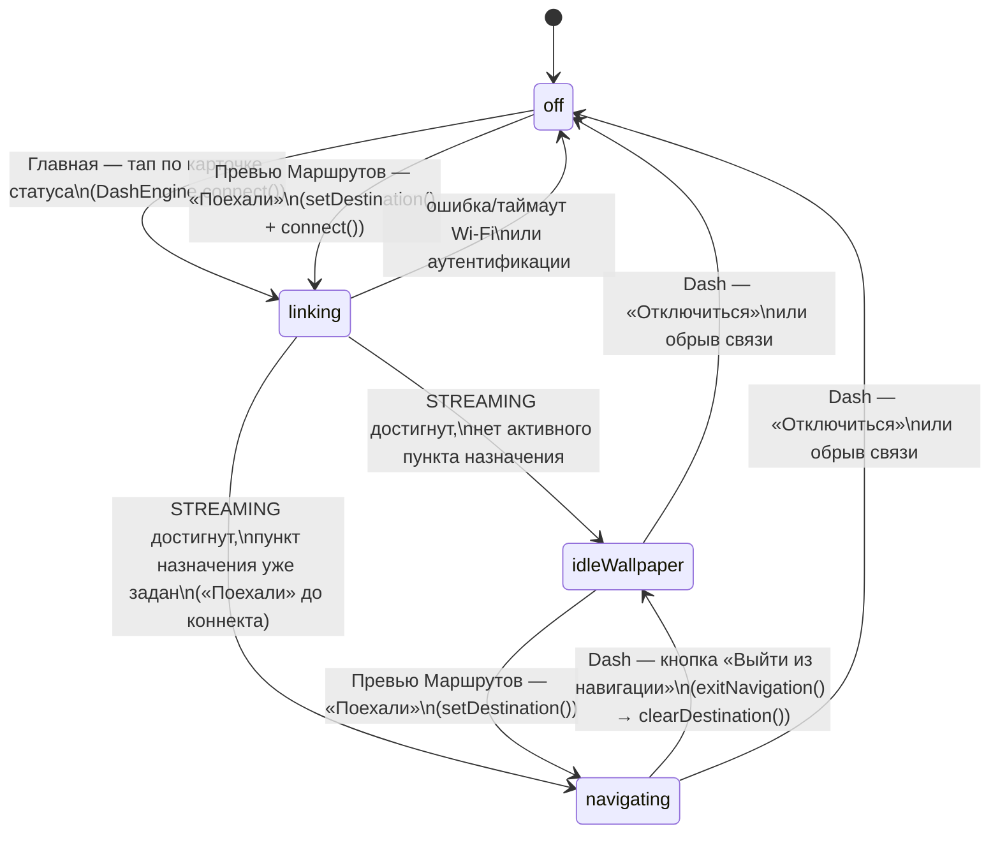

# Конечный автомат: что видно на приборке (Dash)

Что происходит на физическом дэше — не зеркало какого-то одного экрана
приложения, а следствие двух независимых флагов нативного движка
(`DashEngineController.kt`):

- **`session.state`** (`DashState`, экспортируется в Dart как `DashStage` —
  см. [`state/dash_engine_state.dart`](../lib/state/dash_engine_state.dart)) —
  дошёл ли Wi-Fi/K1G-хендшейк до `STREAMING`. Цикл рендера кадров
  (`streamJob`) физически не запускается, пока `state != STREAMING` — то
  есть до этого момента дэш **ничего не получает от телефона** и показывает
  собственный экран прошивки.
- **`navigating`** (`Boolean`, ставится в `setDestination`/`clearDestination`)
  — есть ли активный пункт назначения. Определяет, что рисует кадр: карту с
  маршрутом (`MapRenderer`) или статичные обои простоя (`DashIdleRenderer`).

Экраны приложения меняют состояние этого автомата, вызывая методы
`DashEngine` (`packages/opendash_dash_engine`), а не рисуют картинку сами —
рендер и стрим полностью на нативной стороне.

## Диаграмма

## Таблица состояний

| Состояние | `session.state` | `navigating` | Что физически рисуется на дэше | Экран приложения, с которого обычно виден |
|---|---|---|---|---|
| `off` | `IDLE` / `ERROR` | — | Собственный boot/standby экран прошивки дэша — телефон ничего не передаёт (кадровый цикл не запущен) | [Главная](home_screen.md) — карточка статуса «Не в сети» |
| `linking` | `CONNECTING` / `AUTHENTICATING` / `READY` | не важно | Тот же экран прошивки — Wi-Fi/K1G-хендшейк идёт, но `streamJob` ещё не стартовал | [Главная](home_screen.md) — «Поиск…»; [Dash](dash_screen.md) — соответствующий `_stageLabel` в AppBar |
| `idleWallpaper` | `STREAMING` | `false` | Статичное фото/GIF из `DashWallpaperStore` (`DashIdleRenderer`), либо служебный кадр "waiting", если ни один слот обоев не задан | [Главная](home_screen.md) — карточка статуса «Подключено», без выбранного маршрута; [Dash](dash_screen.md) открыт напрямую без навигации |
| `navigating` | `STREAMING` | `true` | Карта (`MapRenderer`): позиция райдера, маршрут, следующий манёвр/ETA; поверх — метка потери/слабого GPS при `gpsLost`/`gpsWeak` | [Превью Маршрутов](route_preview_screen.md) сразу после «Поехали»; [Dash](dash_screen.md) во время активной навигации |

Карточки входящего звонка/медиа (`updateNowPlaying`/`updateCall`) идут по
отдельному K1G-каналу и рисуются самой прошивкой дэша поверх любого из
состояний выше — они не часть кадра, который стримит телефон, и поэтому не
отдельные состояния этого автомата.

## Таблица переходов

| Откуда | Событие / условие | Куда | Что вызывается |
|---|---|---|---|
| `off` | Главная: тап по карточке статуса (`DashStage.idle`/`error`, есть GPS-permission) | `linking` | `DashEngine.instance.connect()` |
| `off` | Dash: FAB «Подключиться» | `linking` | `DashEngine.instance.connect()` |
| `off` | Превью Маршрутов: «Поехали» | `linking` → (см. ниже, `navigating` как только `STREAMING`) | `RouteController.sendToDash()`: `setDestination()`, затем `connect()` |
| `linking` | Wi-Fi/аутентификация не удалась или таймаут | `off` (`DashStage.error`) | нативно, без вызова из Dart |
| `linking` | Хендшейк дошёл до `STREAMING`, `navigating == false` | `idleWallpaper` | нативно (`session.state.collect { READY → startStream() }`); картинка берётся из уже отправленного `DashEngine.setWallpaper()` (см. [Настройки](settings_screen.md)) |
| `linking` | Хендшейк дошёл до `STREAMING`, `navigating == true` | `navigating` | то же, но пункт назначения уже был выставлен `setDestination()` до/во время коннекта |
| `idleWallpaper` | Превью Маршрутов: «Поехали» | `navigating` | `RouteController.sendToDash()`: `DashEngine.setDestination()` (уже подключено, `connect()` — no-op) |
| `navigating` | Dash: FAB «Выйти из навигации» | `idleWallpaper` | `RouteController.exitNavigation()` → `DashEngine.clearDestination()` |
| `idleWallpaper` / `navigating` | Dash: FAB «Отключиться» | `off` | `DashEngine.instance.disconnect()` |
| `idleWallpaper` / `navigating` | Обрыв Wi-Fi-связи с дэшем | `off` (`DashStage.error`) | нативно, без вызова из Dart |
| любое | Настройки: смена обоев на активном слоте, пока `idleWallpaper` | `idleWallpaper` (кадр перерисовывается) | `DashWallpaperStore` пушит `DashEngine.setWallpaper()` — не меняет состояние автомата, только содержимое |

## Заметки

- Автомат описывает именно **картинку кадра**, а не `DashStage` из
  [`state/dash_engine_state.dart`](../lib/state/dash_engine_state.dart)
  напрямую: `DashStage` не различает `idleWallpaper`/`navigating` — оба
  относятся к `DashStage.streaming`. Различие видно только по
  `RouteController.state.destination` / факту вызова `setDestination()`.
- Источник истины на нативной стороне —
  [`DashEngineController.kt`](../packages/opendash_dash_engine/android/src/main/kotlin/com/opendash/opendash_dash_engine/DashEngineController.kt):
  `tick()` выбирает `tickIdle()` vs навигационный рендер по флагу
  `navigating`, который выставляют только `setDestination`/`clearDestination`.
- `linking` может занять заметное время (Wi-Fi-подключение к дэшу как к
  точке доступа + K1G-аутентификация) — в этот период дэш не показывает
  никакого фидбэка от телефона, только собственный экран прошивки.
