# Конечный автомат: что видно на приборке (Dash)

Что происходит на физическом дэше — не зеркало какого-то одного экрана
приложения, а следствие двух независимых флагов нативного движка
(`DashEngineController.kt`):

- **`session.state`** (`DashState`, экспортируется в Dart как `DashStage` —
  см. [`state/dash_engine_state.dart`](../lib/state/dash_engine_state.dart)) —
  дошёл ли Wi-Fi/K1G-хендшейк до `STREAMING`. Цикл рендера кадров
  (`streamJob`) физически не запускается, пока `state != STREAMING` — то
  есть до этого момента дэш **ничего не получает от телефона** и показывает
  собственный экран прошивки.
- **`navigating`** (`Boolean`, ставится в `setDestination`/`clearDestination`)
  — есть ли активный пункт назначения. **Кадр в обоих случаях один и тот же —
  карта** (`MapRenderer`); флаг определяет только содержимое карточки маршрута
  на самом дэше и наличие живых нав-данных.

Экраны приложения меняют состояние этого автомата, вызывая методы
`DashEngine` (`packages/opendash_dash_engine`), а не рисуют картинку сами —
рендер и стрим полностью на нативной стороне.

## Диаграмма

```mermaid
stateDiagram-v2
    [*] --> off

    off --> linking: Главная — тап по карточке статуса\n(DashEngine.connect())
    off --> linking: Превью Маршрутов — «Поехали»\n(setDestination() + connect())

    linking --> off: ошибка/таймаут Wi‑Fi\nили аутентификации
    linking --> idleMap: STREAMING достигнут,\nнет активного пункта назначения
    linking --> navigating: STREAMING достигнут,\nпункт назначения уже задан\n(«Поехали» до коннекта)

    idleMap --> navigating: Превью Маршрутов — «Поехали»\n(setDestination())
    navigating --> idleMap: Dash — кнопка «Выйти из навигации»\n(exitNavigation() → clearDestination())

    idleMap --> off: Dash — «Отключиться»\nили обрыв связи
    navigating --> off: Dash — «Отключиться»\nили обрыв связи
```

## Таблица состояний

| Состояние | `session.state` | `navigating` | Что физически рисуется на дэше | Экран приложения, с которого обычно виден |
|---|---|---|---|---|
| `off` | `IDLE` / `ERROR` | — | Собственный boot/standby экран прошивки дэша — телефон ничего не передаёт (кадровый цикл не запущен) | [Главная](home_screen.md) — карточка статуса «Не в сети» |
| `linking` | `CONNECTING` / `AUTHENTICATING` / `READY` | не важно | Тот же экран прошивки — Wi-Fi/K1G-хендшейк идёт, но `streamJob` ещё не стартовал | [Главная](home_screen.md) — «Поиск…»; [Dash](dash_screen.md) — соответствующий `_stageLabel` в AppBar |
| `idleMap` | `STREAMING` | `false` | Та же карта (`MapRenderer`), но без маршрута и без пункта назначения: позиция райдера и дороги вокруг. Карточка маршрута дэша показывает заглушку «OpenDash» без живых цифр | [Главная](home_screen.md) — карточка статуса «Подключено», без выбранного маршрута; [Dash](dash_screen.md) открыт напрямую без навигации |
| `navigating` | `STREAMING` | `true` | Карта (`MapRenderer`): позиция райдера, маршрут, следующий манёвр/ETA; поверх — метка потери/слабого GPS при `gpsLost`/`gpsWeak` | [Превью Маршрутов](route_preview_screen.md) сразу после «Поехали»; [Dash](dash_screen.md) во время активной навигации |

Карточки входящего звонка/медиа (`updateNowPlaying`/`updateCall`) идут по
отдельному K1G-каналу и рисуются самой прошивкой дэша поверх любого из
состояний выше — они не часть кадра, который стримит телефон, и поэтому не
отдельные состояния этого автомата.

## Кнопки дэша

Джойстик/медиа-кнопки дэша шлют `09 00`; `DashSession` их только
подтверждает (ack) и пробрасывает код наверх — `DashEngineController.onButton`
→ плагин кладёт `{"button": code}` в `dashEngineRawStreamProvider`. Что код
*означает*, решает
[`DashButtonController`](../lib/state/dash_button_controller.dart) (Dart).
На `navigating` он больше не смотрит вовсе — раз кадр всегда карта, next/prev
означают одно и то же в обоих состояниях; решают только текущие
`nowPlayingTitle`/`incomingCaller`/`hasActiveCall` (поля `DashEngineState`):

| Состояние | Кнопка | Действие |
|---|---|---|
| любое, идёт музыка | next/prev | `DashEngine.skipNext()/skipPrevious()` |
| любое, музыки нет | next/prev | `DashEngine.zoomIn()/zoomOut()` (запасной маппинг) |
| любое | zoom in/out | `DashEngine.zoomIn()/zoomOut()` |
| любое, есть звонящий (`incomingCaller != null`) | «ответить» | `DashEngine.answerCall()` |
| любое, есть звонок вообще (`hasActiveCall`, включая уже принятый/исходящий) | «сброс» | `DashEngine.hangupCall()` |

`DashButtonController` подписан eagerly из `main.dart` — иначе, пока ни один
экран его не «смотрит», нажатия кнопок на дэше уходят в никуда.

Часть прошивок шлёт для next/prev не медиа-коды, а свой набор
(`0x05`/`0x06`/`0x07`/`0x22`); он проверяется последним и ведёт туда же —
в skip при играющей музыке, иначе в зум.

## Таблица переходов

| Откуда | Событие / условие | Куда | Что вызывается |
|---|---|---|---|
| `off` | Главная: тап по карточке статуса (`DashStage.idle`/`error`, есть GPS-permission) | `linking` | `DashEngine.instance.connect()` |
| `off` | Dash: FAB «Подключиться» | `linking` | `DashEngine.instance.connect()` |
| `off` | Превью Маршрутов: «Поехали» | `linking` → (см. ниже, `navigating` как только `STREAMING`) | `RouteController.sendToDash()`: `setDestination()`, затем `connect()` |
| `linking` | Wi-Fi/аутентификация не удалась или таймаут | `off` (`DashStage.error`) | нативно, без вызова из Dart |
| `linking` | Хендшейк дошёл до `STREAMING`, `navigating == false` | `idleMap` | нативно (`session.state.collect { READY → startStream() }`); кадр — карта вокруг текущей позиции, маршрута в ней нет |
| `linking` | Хендшейк дошёл до `STREAMING`, `navigating == true` | `navigating` | то же, но пункт назначения уже был выставлен `setDestination()` до/во время коннекта |
| `idleMap` | Превью Маршрутов: «Поехали» | `navigating` | `RouteController.sendToDash()`: `DashEngine.setDestination()` (уже подключено, `connect()` — no-op) |
| `navigating` | Dash: FAB «Выйти из навигации» | `idleMap` | `RouteController.exitNavigation()` → `DashEngine.clearDestination()` |
| `idleMap` / `navigating` | Dash: FAB «Отключиться» | `off` | `DashEngine.instance.disconnect()` |
| `idleMap` / `navigating` | Обрыв Wi-Fi-связи с дэшем | `off` (`DashStage.error`) | нативно, без вызова из Dart |

## Заметки

- Автомат описывает именно **картинку кадра**, а не `DashStage` из
  [`state/dash_engine_state.dart`](../lib/state/dash_engine_state.dart)
  напрямую: `DashStage` не различает `idleMap`/`navigating` — оба
  относятся к `DashStage.streaming`. Различие видно по отдельному полю
  `DashEngineState.navigating` — прямому зеркалу нативного `navigating`,
  пушится в Dart сразу из `setDestination()`/`clearDestination()` (не только
  на очередном тике кадрового цикла), а не выводится из
  `RouteController.state.destination` — тот выставляется уже на этапе
  предпросмотра маршрута, до факта отправки на дэш, и потому сам по себе не
  годится как признак `navigating`.
- Источник истины на нативной стороне —
  [`DashEngineController.kt`](../packages/opendash_dash_engine/android/src/main/kotlin/com/opendash/opendash_dash_engine/DashEngineController.kt):
  `tick()` рисует карту всегда и ни на что не ветвится, а `navigating`
  (его выставляют только `setDestination`/`clearDestination`) читает
  `DashSession` — для карточки маршрута и признака `navActive`.
- `linking` может занять заметное время (Wi-Fi-подключение к дэшу как к
  точке доступа + K1G-аутентификация) — в этот период дэш не показывает
  никакого фидбэка от телефона, только собственный экран прошивки.
